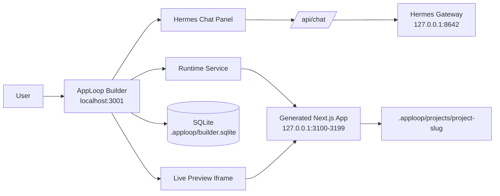

# AppLoop: A Local-First Visual Builder For Next.js Apps

> An agentic AI app builder with visual editing and production-ready code.

What if building an app felt less like describing a screenshot to a chatbot and more like editing the running interface directly?

That is the idea behind **AppLoop**, a local-first visual builder for generated Next.js applications. AppLoop gives every project its own workspace, preview runtime, Hermes chat session, selected theme, runtime logs, and live iframe preview. Instead of treating AI-assisted development as a detached prompt box, AppLoop connects the prompt, the running app, the selected UI element, and the generated source code into one focused workflow.

The builder runs locally at `http://localhost:3001`. Generated apps run as separate Next.js development servers on `127.0.0.1:3100-3199`, which keeps the builder and the generated project isolated while still giving you a real browser-like preview.

## The Core Idea

AppLoop is built around a simple loop:

1. Create or open a project.
2. Start the generated Next.js preview.
3. Inspect the UI visually.
4. Select the exact element you want to change.
5. Send a prompt to Hermes with that target context.
6. Validate the result in the live preview.

That loop is what makes AppLoop feel different from a conventional code generator. The generated app is not a static mockup or screenshot. It is a real project running locally with hot reload, route controls, runtime logs, and project-specific state.

## Visual Targeting: Prompt The Exact Element

The standout feature is AppLoop's visual inspector.

Click `Inspect`, hover over the live preview, and AppLoop highlights the exact block, container, button, input, or section under the cursor. The overlay displays the element classname and selector context, so you can see what will be targeted before asking Hermes to modify it.

When you click an element, AppLoop locks it as the active target and shows a `Target classname` card in the chat panel. Your next prompt is automatically enriched with that selected classname, preferred selector, geometry, and surrounding visual metadata.

That means a prompt like:

```text
Make this hero section tighter and add a placeholder image area.
```

can be grounded to the exact `.admin-hero .dashboard-header` element you selected in the preview. You no longer have to explain where something is on the page with vague phrases like "the big section near the top." AppLoop knows what you clicked.

## A Builder, Not Just A Chat Box

AppLoop combines a Hermes chat panel with a browser-like preview surface:

- A live iframe preview for the generated Next.js app.
- Route input, back, forward, reload, and open-in-new-tab controls.
- Desktop and viewport controls for responsive work.
- Runtime status, logs, restart, and stop controls.
- Persisted chat history and project settings.
- Per-project themes and generated workspace state.

This matters because AI app generation needs feedback. You need to see what changed, inspect what is wrong, and send follow-up instructions with enough context for the agent to repair the right thing. AppLoop keeps that feedback loop close.

## Local-First By Design

AppLoop is intentionally local-first.

Generated projects live under `.apploop/projects/<slug>`. Runtime logs, local SQLite data, project settings, conversations, and preview process state stay on your machine. The default database is SQLite through Drizzle, and generated apps run as local child processes rather than remote deployments.

This gives the workflow a practical development feel:

- You can inspect generated files directly.
- You can run lint, typecheck, and tests locally.
- You can keep generated app state out of Git until it is ready.
- You can use local or remote model providers depending on your setup.

## Hermes Under The Hood

AppLoop integrates with Hermes through a server-side gateway. The browser never receives Hermes API keys; AppLoop's backend owns the Hermes client and sends project-scoped context to the gateway.

Each AppLoop run includes project metadata such as workspace path, selected theme, package policy, validation depth, default route, and a Hermes agent bundle. That bundle references the AppLoop-specific Hermes agents, skills, hooks, and commands stored under `.hermes/`.

The result is a clean boundary:

- AppLoop owns project records, runtime control, iframe preview, and chat streaming.
- Hermes agents own generated-project edit workflows, validation, repair, and source modifications.

## Themes And Templates

AppLoop starts projects from built-in Next.js templates and applies shadcn/Luma-inspired themes. Today it includes a default generated Next.js template and an admin-style Luma template, plus a catalog of theme token sets.

Themes are not just decoration. They become part of the project context Hermes receives, so generated edits can preserve the selected design language instead of introducing random hard-coded colors.

## Local Model Flexibility

AppLoop can work with hosted providers through Hermes, including OpenRouter, and it also documents a local Apple Silicon path with MLX tooling.

The repo includes Makefile helpers for downloading and running `mlx-community/Qwen3.6-27B-OptiQ-4bit` locally under `~/models/qwen/`. The model can be served through an OpenAI-compatible local endpoint, then routed through Hermes as a local provider.

That gives AppLoop a flexible AI path:

- Use OpenRouter for hosted model access.
- Use Tavily for search-capable Hermes workflows when needed.
- Use local MLX models for private, local model experimentation on Apple Silicon.

## The Architecture In One Picture



## Why This Is Useful

AppLoop is for the moment when plain prompt-based generation starts to feel too loose.

You might know what you want visually, but not want to hunt through generated source files. You might see the exact broken button, hero, card, or layout section in the preview, but not want to describe it in paragraphs. AppLoop turns that visual intent into structured context for the agent.

The workflow is especially useful for:

- Iterating on generated Next.js apps.
- Building admin dashboards or product interfaces.
- Applying and preserving design themes.
- Debugging preview/runtime failures locally.
- Making targeted UI edits without losing project context.

## What Comes Next

The next major direction is **E18: Deployment & Remote Runtimes**, expanding beyond local previews toward remote execution and deployment workflows.

Another planned direction is **Design Mode**: selecting elements directly in the preview, modifying styles through a visual panel, applying those changes back to source code, and accepting natural-language instructions to refine the interface.

Together, those steps move AppLoop toward a richer visual app-building environment: local when you want control, remote when you need deployment, and visual when words alone are not precise enough.
