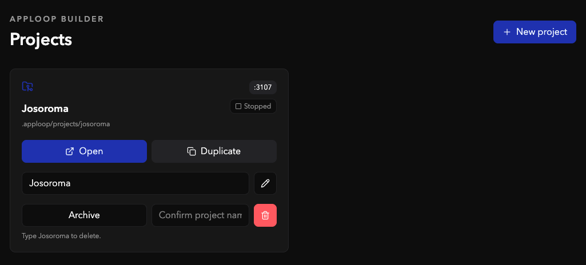
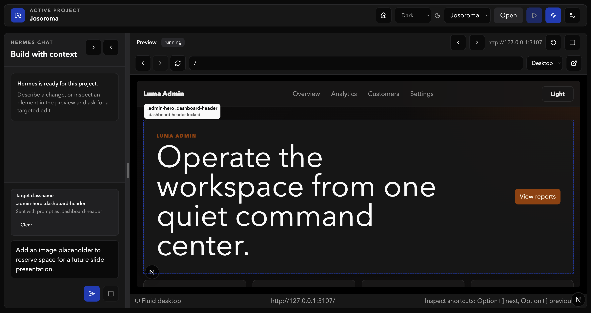
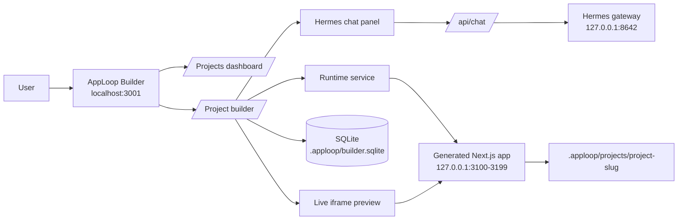
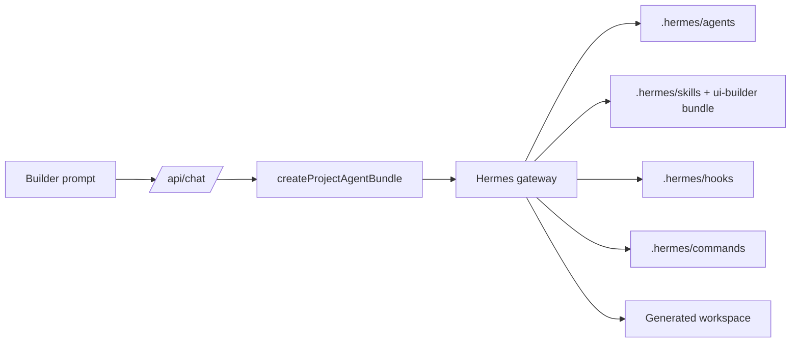

# AppLoop

AppLoop is a local-first visual builder for generated Next.js apps. It gives each project its own workspace, preview port, runtime process, persisted Hermes chat, theme settings, and live iframe preview.

The builder itself runs on `http://localhost:3001`. Generated apps run separately on `http://127.0.0.1:3100+`.

## Table Of Contents

- [Visual Targeting With Prompts](#visual-targeting-with-prompts)
- [Project Edit Help](#project-edit-help)
- [Screenshots And Wireframes](#screenshots-and-wireframes)
- [What It Does](#what-it-does)
- [Tech Stack](#tech-stack)
- [Architecture](#architecture)
- [Repository Layout](#repository-layout)
- [Project Guidance And Docs](#project-guidance-and-docs)
- [Prerequisites](#prerequisites)
- [Configuration Files](#configuration-files)
- [Hermes Assets Used By AppLoop](#hermes-assets-used-by-apploop)
- [Setup](#setup)
- [OpenRouter Setup](#openrouter-setup)
- [MLX-VLM Local Qwen Setup](#mlx-vlm-local-qwen-setup)
- [Tavily Setup](#tavily-setup)
- [Run The Builder](#run-the-builder)
- [Run Hermes Locally](#run-hermes-locally)
- [Create And Preview A Project](#create-and-preview-a-project)
- [Visual Inspector Workflow](#visual-inspector-workflow)
- [Templates](#templates)
- [Themes](#themes)
- [Commands](#commands)
- [Validation](#validation)
- [Environment Reference](#environment-reference)
- [Notes](#notes)
- [Next Steps](#next-steps)

## Visual Targeting With Prompts

AppLoop's standout workflow is visual targeting: click `Inspect`, hover over the live preview, and AppLoop highlights the exact block, button, input, container, or section under your cursor. The overlay shows the element's classname so you can see what will be changed before you ask Hermes to edit anything.

When you click a highlighted element, AppLoop locks it as the prompt target and shows a `Target classname` card in the chat panel. That card records the selected classname, the preferred selector sent to Hermes, and the surrounding visual selection metadata. Your next prompt is automatically enriched with that target context, so a request like "make this hero tighter" is grounded to the selected element instead of relying on a vague description.

This makes AppLoop feel closer to a design tool than a plain chat box: inspect the running app, select the exact UI surface, write the change you want, and let Hermes operate on the intended classname with project context, theme rules, and preview validation.

## Project Edit Help

Project edit is the main AppLoop workflow inside `app/projects/[projectId]/page.tsx`: a persisted Hermes conversation sits beside a live iframe preview of the generated Next.js app. A project edit can be a plain text request, a targeted visual edit, an edit-and-resend retry, or a restore to an earlier pre-prompt state.

### What Project Edit Controls

| Surface | Owner | Behavior |
|---|---|---|
| Chat panel | AppLoop builder | Captures prompts, shows Hermes responses, tracks checkpoints, supports Restore/Edit, and persists messages to SQLite. |
| Preview iframe | Generated Next.js app | Runs from `.apploop/projects/<slug>` on a preview port in the `3100-3199` range. |
| Runtime controls | AppLoop runtime service | Starts, stops, restarts, and tails logs for the generated app process. |
| Hermes run | Hermes gateway | Receives project context, workspace path, prompt text, model/provider metadata, and the AppLoop agent bundle. |
| Source files | Hermes agents | Make generated-project edits only inside the trusted `workspacePath`. |

### Prompt Flow

1. The user writes a prompt in the project builder textarea.
2. If inspect targets are selected, AppLoop expands the prompt with the selected target list and `Target selections JSON`.
3. Before sending, AppLoop creates a git-backed file checkpoint in the generated workspace.
4. `/api/chat` stores the user message, creates a run record, resolves the project, and calls Hermes through `lib/hermes/client.ts`.
5. `createProjectAgentBundle()` attaches the repo-local AppLoop Hermes metadata: agents, `/ui-builder` bundle, skills, hooks, commands, isolation rules, completion criteria, and validation script.
6. Hermes streams text and activity events back to the chat panel.
7. AppLoop persists the assistant message, updates run status, refreshes preview state, and saves current session messages.

### Gateway Bundle Usage

Every project edit sent through the Hermes gateway includes the AppLoop project bundle. The gateway payload carries `agentBundle` as top-level data and inside metadata so Hermes can follow the repo-local assets:

- Agents in `.hermes/agents/`
- Bundle in `.hermes/bundles/ui-builder/BUNDLE.md`
- Skills in `.hermes/skills/`
- Hooks in `.hermes/hooks/`
- Commands in `.hermes/commands/`

The `/ui-builder` bundle activates, in order: `/security-review`, `/hermes-gateway`, `/visual-selector`, `/theme-system`, `/frontend-design`, `/generated-app-standards`, and `/project-runtime`. The gateway instructions also restate the generated-code classname contract so prompt-created UI remains inspectable.

### How The Prompt Is Designed For Senior Modern Design

AppLoop prompts are intentionally more structured than raw chat. They combine the user's natural-language request with project and visual context so Hermes can behave like a senior product engineer/designer rather than a generic code generator:

- **Concrete target**: selected elements send exact classnames, preferred selectors, route, ancestry, text preview, and bounding box metadata.
- **Boundary discipline**: targeted prompts say to modify only the exact selected elements or their descendants unless the user explicitly asks for a broader change.
- **Theme awareness**: the selected Luma/shadcn theme, custom token settings, and theme-system rules are included through the agent bundle.
- **Modern UI expectations**: `/frontend-design` asks Hermes to think in hierarchy, spacing, contrast, responsive behavior, accessibility, and coherent component composition.
- **Generated-code standards**: `/generated-app-standards` forces TypeScript-safe, route-local, named-export, template-compatible code.
- **Inspectability contract**: any new user-visible UI must include shared/base classnames where useful plus a unique, human-readable classname written last for inspect-mode selection.
- **Validation loop**: hooks and commands tell Hermes to validate, repair bounded failures, and report affected files and blockers.

### Unique Classname Rule For Generated UI

All template and prompt-created UI must remain selectable in inspect mode. That means every user-visible generated element needs classnames, and every element needs a unique, human-readable selector classname.

Use this pattern:

```txt
base-class optional-shared-class unique-human-readable-class
```

Examples:

```txt
hero-title admin-hero-title
metric-card summary-card metric-revenue
metric-label metric-revenue-label
metric-value metric-revenue-value
panel-copy health-panel-copy
site-nav-link site-nav-pricing
```

Important details:

- The unique classname goes **last** because `inspector-provider.tsx` uses the last classname as `preferredSelector`.
- Repeated elements must get unique classnames from their data model, not generic suffixes like `card-1` or `item-2`.
- Child text elements inside repeated cards also need unique classnames, not just the parent card.
- Shared/base classnames are still useful for styling groups, but they are not enough for inspect mode.
- The template body classname must stay on `<body>`: `template-default` or `template-admin-luma`.

### Project Edit Triggers And Actions

| Trigger | What AppLoop does | What Hermes should do |
|---|---|---|
| Send prompt | Creates a file checkpoint, persists user message, sends prompt + bundle to Hermes. | Read relevant files, edit generated workspace, validate, report changed files. |
| Send prompt with selected target | Adds target selectors and selection JSON to the prompt. | Locate the exact selected boundary and limit edits to it or descendants. |
| Paste image into prompt | Uploads and attaches the image as context. | Use the image as visual reference; still edit source files, not pixels. |
| Stop prompt | Calls chat stop and `/api/chat/cancel`. | Stop the active Hermes run if possible. |
| Restore on a past user message | Reverts files to the pre-prompt git checkpoint, removes that prompt and later messages from UI and DB, restarts preview. | No new Hermes run is sent. |
| Edit on a past user message | Performs Restore, then pre-fills the textarea with the original prompt. | Wait for the user to resend the edited prompt. |
| New session | Saves current session boundary, clears chat UI, clears targets/screenshots, preserves project workspace. | Future prompts start with fresh conversation context. |
| Runtime restart | Kills and starts the generated Next.js process for fresh source reads. | Use logs/validation if preview health is involved. |

### Restore, Edit, And Persistence

Before every prompt, AppLoop snapshots generated project files with git. Restore/Edit uses that snapshot to undo source changes from the selected prompt. It also truncates the chat and deletes persisted SQLite messages from the clicked prompt onward, including the triggering prompt itself, so stale prompts and assistant replies do not reappear after reload.

- **Restore**: revert files, delete the prompt and everything after it, clear the future conversation, restart preview.
- **Edit**: same as Restore, then put the original prompt text back in the textarea for editing and resending.
- **New session**: save the current chat as a session boundary and begin a clean conversation without rolling back files.

### Validation And Completion

Hermes should not treat a project edit as complete after only writing files. The expected completion path is:

1. Inspect existing files before modifying them.
2. Keep writes inside the generated `workspacePath`.
3. Preserve or add unique inspect classnames for all generated UI elements.
4. Run the relevant generated-project checks, normally typecheck and lint.
5. Check runtime or preview health when the visual result is affected.
6. Report affected files, validation results, and any unresolved blocker.

### Common Behaviors And Pitfalls

- Inspect mode disables link/button navigation so clicks select boundaries instead of navigating away.
- The prompt target should use `preferredSelector`, not a shared base classname.
- If the user says the wrong element changed, inspect similarly named classnames such as `dashboard-header` versus `dashboard-page-header` before retrying.
- CSS hot reload can be stale; restarting the runtime forces Turbopack to reread generated files.
- Gateway prompts must keep the AppLoop bundle attached so Hermes sees agents, skills, hooks, commands, and classname rules.
- The generated project owns app code; the builder owns project records, runtime control, chat persistence, and preview routing.

## Screenshots And Wireframes

### Projects dashboard:



### Current project builder page:



Additional wireframes are available in `docs/wireframe-01.png` through `docs/wireframe-10.png`.

## What It Does

- Create projects from built-in Next.js templates.
- Pick a shadcn/Luma theme at project creation and update it later in settings.
- Run each generated project as a real Next.js dev server in an iframe preview.
- Chat with Hermes through a streaming Vercel AI SDK interface.
- Inspect elements in the preview, lock a target classname, and send that target with the next prompt.
- View runtime status and logs, restart/stop preview processes, and return to the project homepage.
- Persist projects, conversations, messages, runs, runtimes, settings, and themes locally with SQLite.

## Tech Stack

- Next.js `16.2.9` with App Router
- React `19.2.4`
- TypeScript strict mode
- Tailwind CSS v4
- Vercel AI SDK (`ai`, `@ai-sdk/react`)
- Drizzle ORM with SQLite/libSQL
- Zustand for builder UI state
- `react-resizable-panels` for the chat/preview layout
- Radix Dialog primitives and local shadcn-style UI components
- Vitest and Playwright

## Architecture



## Repository Layout

```text
app/                         Next.js app routes and API routes
components/builder/          Builder shell, preview frame, theme select, UI state
components/projects/         Project creation UI
components/ui/               Local UI primitives
docs/                        Product specs, wireframes, screenshots
lib/chat/                    Chat message helpers and active-run store
lib/db/                      Drizzle schema, migrations, repository
lib/env/                     Server environment validation
lib/hermes/                  Hermes client, event parsing, agent bundle metadata
lib/observability/           Structured local event helpers
lib/preview/                 Preview URL, iframe, viewport, and trust helpers
lib/project-recovery/        Runtime recovery helpers
lib/project-validation/      Generated project validation helpers
lib/projects/                Project services, actions, templates, filesystem ops
lib/runtime/                 Preview process lifecycle, logs, ports, provider
lib/security/                Authorization, path, command, and secret guards
lib/themes/                  Built-in themes, custom tokens, workspace apply logic
lib/visual-selector/         Inspector schema and prompt target helpers
templates/                   Generated app templates copied into .apploop/projects
tests/                       Vitest and Playwright test coverage
```

Local generated state is written to `.apploop/` and is ignored by Git.

## Project Guidance And Docs

AppLoop keeps repo-level guidance files at the root so humans and coding agents share the same product boundaries, commands, and validation expectations.

| Path | Purpose |
|---|---|
| [SOUL.md](SOUL.md) | Product principles for AppLoop, including local-first behavior, visual targeting, theme boundaries, Hermes ownership, and engineering posture. |
| [AGENTS.md](AGENTS.md) | General coding-agent instructions for working in this repository, including key surfaces, commands, generated-state rules, validation expectations, Hermes assets, and security rules. |
| [CLAUDE.md](CLAUDE.md) | Claude-specific project guidance with start-here docs, common development tasks, environment notes, editing rules, and validation notes. |
| [docs/](docs/) | Product documentation folder containing [docs/SPECS.md](docs/SPECS.md), current screenshots, wireframes, and [docs/README.md](docs/README.md), which explains each image and how the spec references them. |

## Prerequisites

- Node.js `22.x` recommended. The current workspace has been validated with Node `v22.13.1`.
- npm, included with Node.
- Optional: `make` for the convenience commands in `Makefile`.
- Optional but required for real AI edits: Hermes CLI/gateway and a model provider key such as OpenRouter.
- Optional for web-search-capable Hermes workflows: Tavily API key.

## Configuration Files

AppLoop uses a small set of local configuration files. Secrets should stay in `.env` or `.hermes/.env`; do not commit real keys.

| File | Purpose |
|---|---|
| `.env-example` | Template for local builder, Hermes gateway, OpenRouter, Tavily, preview ports, and SQLite settings. |
| `.env` | Your uncommitted local copy of `.env-example`; loaded by Next.js and sourced by Makefile Hermes commands. |
| `.hermes/.env` | Optional repo-local Hermes environment file; sourced by `make hermes-*` before `.env`. |
| `.hermes/config.yaml` | Hermes YAML config. This repo currently enables the API server and routes `deepseek/deepseek-v4-pro` through OpenRouter. |
| `Makefile` | Defines `HERMES_HOME=.hermes`, gateway defaults, and helper commands such as `make hermes-gateway`. |

The current `.hermes/config.yaml` shape is:

```yaml
platforms:
  api_server:
    enabled: true
    extra:
      model_routes:
        "deepseek/deepseek-v4-pro":
          model: deepseek/deepseek-v4-pro
          provider: openrouter
```

## Hermes Assets Used By AppLoop

AppLoop keeps its Hermes customization under `.hermes/`. The Next.js app does not execute these Markdown files directly in the browser. Instead, when a user sends a builder prompt, `/api/chat` creates a project run with `createProjectAgentBundle()` from `lib/hermes/agents.ts` and sends that bundle metadata to the server-side `HermesClient`. Hermes agents then use the referenced agents, bundle, skills, hooks, and commands while operating on the generated workspace.



### Agents

Agents live in `.hermes/agents/` and are registered in `lib/hermes/agents.ts`.

| Agent | File | Used when |
|---|---|---|
| Project Builder Orchestrator | `.hermes/agents/project-builder.md` | Every AppLoop chat run. It resolves project context, delegates work, and enforces completion criteria. |
| UI Architect | `.hermes/agents/ui-architect.md` | When the requested change affects layout, visual hierarchy, theme application, responsiveness, or accessibility. |
| Next.js Implementer | `.hermes/agents/nextjs-implementer.md` | When Hermes needs to edit generated Next.js routes, components, styles, or project files. |
| Validation And Repair | `.hermes/agents/validation-repair.md` | After edits or runtime failures, especially for lint, typecheck, preview health, and bounded repair loops. |
| Security Auditor | `.hermes/agents/security-auditor.md` | Before risky tool use or when path containment, secrets, commands, iframe boundaries, or generated-workspace isolation matter. |

### UI Builder Bundle

The main bundle is `.hermes/bundles/ui-builder/BUNDLE.md` and is registered as `/ui-builder` in `lib/hermes/skills.ts`.

| Bundle | Used when | What it activates |
|---|---|---|
| `/ui-builder` | Every generated-project run sent from AppLoop to Hermes. | The AppLoop UI builder skill set in this order: security review, Hermes gateway, visual selector, theme system, frontend design, generated app standards, and project runtime. |

### Skills

AppLoop registers the skills below in `lib/hermes/skills.ts`. The `/ui-builder` bundle activates `/security-review`, `/hermes-gateway`, `/visual-selector`, `/theme-system`, `/frontend-design`, `/generated-app-standards`, and `/project-runtime` for generated-project work. Other folders may exist under `.hermes/skills/`, but they are not included in AppLoop's project-run bundle unless Hermes is invoked manually outside this flow.

| Skill | File | Used when |
|---|---|---|
| `/security-review` | `.hermes/skills/security-review/SKILL.md` | Establishing project isolation, reviewing dangerous commands, checking secret exposure, and guarding iframe/runtime boundaries. |
| `/visual-selector` | `.hermes/skills/visual-selector/SKILL.md` | A prompt includes selected element metadata from the preview inspector, such as classname, selector payload, ancestry, or source hints. |
| `/theme-system` | `.hermes/skills/theme-system/SKILL.md` | Creating, applying, validating, or repairing shadcn/Luma theme tokens in generated apps. |
| `/frontend-design` | `.hermes/skills/frontend-design/SKILL.md` | Planning and implementing UI changes, layout hierarchy, responsive behavior, accessibility, and semantic class names. |
| `/generated-app-standards` | `.hermes/skills/generated-app-standards/SKILL.md` | Editing generated Next.js code so file naming, component structure, imports, route colocation, schemas, and server actions stay consistent. |
| `/project-runtime` | `.hermes/skills/project-runtime/SKILL.md` | Starting, restarting, checking, or troubleshooting generated preview runtimes and logs. |
| `/hermes-gateway` | `.hermes/skills/hermes-gateway/SKILL.md` | Normalizing Hermes gateway usage, server-only auth, session context, cancellation, stream events, and user-safe errors. |

### Hooks

Hooks live in `.hermes/hooks/` and are registered in `lib/hermes/hooks.ts`. AppLoop sends these hook definitions to Hermes as part of the project agent bundle; Hermes applies them around tool use, edits, and completion.

| Hook | Trigger | File | Used when |
|---|---|---|---|
| Project Scope Guard | `pre-tool-use` | `.hermes/hooks/project-scope-guard/HOOK.md` | Before Hermes reads, writes, or runs commands against project targets. It normalizes paths, resolves symlinks, and blocks traversal outside the generated workspace. |
| Generated Code Review | `post-edit` | `.hermes/hooks/generated-code-review/HOOK.md` | After generated files are edited. It checks generated app conventions such as exports, imports, formatting, component/file matching, route colocation, schemas, and actions. |
| Theme Integrity | `post-edit` | `.hermes/hooks/theme-integrity/HOOK.md` | After style or theme edits. It checks for hard-coded colors, required variables, dark tokens, and selected theme consistency. |
| Preview Readiness | `before-completion` | `.hermes/hooks/preview-readiness/HOOK.md` | Before Hermes reports a run as complete. It checks runtime status, HTTP reachability, compile logs, and preview readiness. |

### Hermes Commands

Commands live in `.hermes/commands/` and are registered in `lib/hermes/commands.ts`. AppLoop includes these command definitions in the metadata sent to Hermes; Hermes agents use them as workflow entry points for project tasks.

| Command | File | Used when |
|---|---|---|
| `/project-build` | `.hermes/commands/project-build.md` | A user asks Hermes to create or significantly change the generated app. Loads the UI builder bundle plus scope and preview readiness guards. |
| `/project-fix` | `.hermes/commands/project-fix.md` | A generated app has validation, runtime, compile, or UI issues that need repair. Loads validation repair and generated code review. |
| `/project-preview` | `.hermes/commands/project-preview.md` | A task is about starting, restarting, checking, or troubleshooting the preview runtime. Loads project runtime and preview readiness. |
| `/project-theme` | `.hermes/commands/project-theme.md` | A task changes the selected theme, token values, or generated app theme application. Loads theme system and theme integrity. |
| `/project-element-edit` | `.hermes/commands/project-element-edit.md` | A prompt includes a selected preview element and should be limited to that visual target. Loads visual selector, frontend design, and generated app standards. |
| `/project-validate` | `.hermes/commands/project-validate.md` | A user asks to validate the generated project or AppLoop needs a post-edit validation pass. Loads validation repair, generated code review, theme integrity, and preview readiness. |
| `/project-snapshot` | `.hermes/commands/project-snapshot.md` | A workflow needs a project snapshot or changed-file summary before or after edits. Loads the UI builder bundle. |

### Runtime Relationship

AppLoop itself owns project records, preview processes, iframe routing, and chat streaming. Hermes agents own the reasoning and workflow for generated-project edits. The bridge between them is the `agentBundle` object sent by `/api/chat`, which includes project context, selected theme, package policy, validation depth, default route, completion criteria, isolation rules, the `/ui-builder` bundle, hooks, and commands.

## Setup

```
make install
make hermes-dashboard
make hermes-gateway
make dev
```

Create a local environment file:

```bash
cp .env-example .env
```

For local Hermes gateway development, the default values are enough to boot the builder UI. To run real Hermes-backed prompts, set a provider key and keep the builder-side API key aligned with the Hermes gateway key:

```bash
OPENROUTER_API_KEY=sk-or-v1-...
TAVILY_API_KEY=tvly-...
API_SERVER_KEY=change-me-local-dev
HERMES_API_KEY=change-me-local-dev
HERMES_BASE_URL=http://127.0.0.1:8642
```

The default local storage settings are:

```bash
PROJECTS_ROOT=.apploop/projects
DATABASE_URL=file:.apploop/builder.sqlite
PREVIEW_PORT_START=3100
PREVIEW_PORT_END=3199
RUNTIME_TIMEOUT_MS=120000
```

## OpenRouter Setup

OpenRouter is the model provider configured by this repo's `.env-example` and `.hermes/config.yaml`.

1. Create an OpenRouter API key.
2. Put it in `.env`:

```bash
OPENROUTER_API_KEY=sk-or-v1-...
HERMES_INFERENCE_PROVIDER=openrouter
HERMES_TUI_PROVIDER=openrouter
HERMES_MODEL=deepseek/deepseek-v4-pro
HERMES_INFERENCE_MODEL=deepseek/deepseek-v4-pro
```

3. Keep `.hermes/config.yaml` pointed at the same provider/model route:

```yaml
platforms:
  api_server:
    enabled: true
    extra:
      model_routes:
        "deepseek/deepseek-v4-pro":
          model: deepseek/deepseek-v4-pro
          provider: openrouter
```

4. Make sure the builder can authenticate to the local Hermes gateway. These two values should match for the default local setup:

```bash
API_SERVER_KEY=change-me-local-dev
HERMES_API_KEY=change-me-local-dev
```

`API_SERVER_KEY` is used by the Hermes gateway. `HERMES_API_KEY` is used by AppLoop's server-side `HermesClient` when it calls `HERMES_BASE_URL`.

## MLX-VLM Local Qwen Setup

This repo includes Makefile helpers for running a local Apple Silicon model server with MLX tooling. The default model is `mlx-community/Qwen3.6-27B-OptiQ-4bit`, downloaded into `~/models/qwen/Qwen3.6-27B-OptiQ-4bit`.

The model card describes this checkpoint as an MLX OptiQ text-generation model for Qwen3.6 27B and recommends loading it with `mlx-lm`. The Makefile still installs MLX-VLM tooling, but the generation and server targets use `mlx-lm` for this checkpoint because `mlx_vlm.generate` strict-loads VLM vision parameters that are not present in the main text shard index. The `mlx-lm` server exposes an OpenAI-compatible `/v1/chat/completions` endpoint that Hermes can target as a local provider.

Install MLX-VLM tooling into a repo-local virtual environment:

```bash
make mlx-vlm-setup
```

Download or resume the model download:

```bash
make mlx-vlm-download
```

Check that all required local model files are present:

```bash
make mlx-vlm-check-model
```

Run one local generation from the command line:

```bash
make mlx-vlm-generate
```

Start the OpenAI-compatible local MLX server:

```bash
make mlx-vlm-server
```

The default server URL is:

```text
http://127.0.0.1:8080/v1
```

Test the running server from another terminal:

```bash
make mlx-vlm-curl-test
```

You can override the defaults when needed:

```bash
MLX_VLM_PORT=8081 make mlx-vlm-server
MLX_VLM_PROMPT="Write a React hook for keyboard shortcuts" make mlx-vlm-generate
MLX_CHAT_TEMPLATE_ARGS='{"enable_thinking": false}' make mlx-vlm-server
```

`MLX_CHAT_TEMPLATE_ARGS` defaults to `{"enable_thinking": false}` so Qwen replies do not include thinking traces in AppLoop or Hermes responses.

### Configure Hermes By Command

Print the Hermes environment variables and YAML route snippet for this local MLX-VLM server:

```bash
make hermes-mlx-vlm-config
```

For local environment configuration, add these values to `.env` or `.hermes/.env`:

```bash
HERMES_MODEL=local-qwen3.6-27b-optiq-4bit
HERMES_INFERENCE_MODEL=local-qwen3.6-27b-optiq-4bit
HERMES_INFERENCE_PROVIDER=mlx-vlm
HERMES_TUI_PROVIDER=mlx-vlm
OPENAI_BASE_URL=http://127.0.0.1:8080/v1
OPENAI_API_KEY=not-needed
```

The local `mlx-lm` server expects the request `model` value to be the full local model directory. The Hermes route alias above keeps the app-facing model name short while mapping the provider request to `~/models/qwen/Qwen3.6-27B-OptiQ-4bit`.

Then restart both local servers:

```bash
make mlx-vlm-server
make hermes-gateway
```

To route Hermes through the local MLX-VLM endpoint, add a model route alongside the existing OpenRouter route in `.hermes/config.yaml`:

```yaml
platforms:
  api_server:
    enabled: true
    extra:
      model_routes:
        "deepseek/deepseek-v4-pro":
          model: deepseek/deepseek-v4-pro
          provider: openrouter
        local-qwen3.6-27b-optiq-4bit:
          model: /Users/your-user/models/qwen/Qwen3.6-27B-OptiQ-4bit
          provider: mlx-vlm
          base_url: http://127.0.0.1:8080/v1
          api_key: not-needed
```

Keep `HERMES_BASE_URL=http://127.0.0.1:8642`; that is AppLoop's connection to the Hermes gateway. The MLX-VLM URL is the model provider endpoint used by Hermes, not the AppLoop-to-Hermes gateway URL.

### Configure Hermes In The Dashboard UI

1. Start the local model server with `make mlx-vlm-server`.
2. Start the Hermes dashboard with `make hermes-dashboard`.
3. Open `http://127.0.0.1:9120`.
4. In provider or model settings, add a local OpenAI-compatible provider.
5. Set provider/name to `mlx-vlm`.
6. Set base URL to `http://127.0.0.1:8080/v1`.
7. Set API key to `not-needed` or any placeholder value accepted by the dashboard.
8. Set model to the full local path, such as `/Users/your-user/models/qwen/Qwen3.6-27B-OptiQ-4bit`, or use the route alias `local-qwen3.6-27b-optiq-4bit` if the dashboard maps aliases to provider model paths.
9. Save, then restart `make hermes-gateway` so AppLoop prompts use the updated Hermes provider configuration.

## Tavily Setup

Tavily is not consumed directly by the AppLoop Next.js code. It is an optional search provider credential for Hermes workflows or skills that perform web search.

1. Create a Tavily API key.
2. Add it to `.env` so the Makefile can pass it to Hermes commands:

```bash
TAVILY_API_KEY=tvly-...
```

3. If you run Hermes outside this Makefile, also add the same key to `.hermes/.env` or the shell that launches Hermes:

```bash
TAVILY_API_KEY=tvly-...
```

4. Start or restart the Hermes gateway after changing the key:

```bash
make hermes-gateway
```

There is no Tavily-specific YAML block in the current repo config. The involved YAML file is `.hermes/config.yaml`, which currently configures the API server and OpenRouter model route; Tavily is provided as an environment variable for Hermes to use when a search-capable workflow asks for it.

## Run The Builder

Start AppLoop on port `3001`:

```bash
npm run dev
```

Or use the Makefile helper, which checks for an existing local Next server on the same port:

```bash
make dev
```

Open:

```text
http://localhost:3001/projects
```

## Run Hermes Locally

If the `hermes` CLI is installed, start the gateway with the repo-local `.hermes` configuration:

```bash
make hermes-gateway
```

Test that it is reachable:

```bash
make hermes-gateway-curl-test
```

Optional Hermes helpers:

```bash
make hermes-chat
make hermes-dashboard
make hermes-desktop
make hermes-update
make hermes-gateway
make hermes-gateway-curl-test
make mlx-vlm-setup
make mlx-vlm-download
make mlx-vlm-check-model
make mlx-vlm-generate
make mlx-vlm-server
make mlx-vlm-curl-test
make hermes-mlx-vlm-config
```

## Create And Preview A Project

1. Open `http://localhost:3001/projects`.
2. Click `New project`.
3. Enter a project name.
4. Choose a template.
5. Choose a theme.
6. Click `Create project`.
7. In the project builder, click `Start` if the preview is not already running.

AppLoop copies the selected template into `.apploop/projects/<slug>`, assigns a preview port, stores project metadata in SQLite, and starts the generated app on `127.0.0.1:<previewPort>`.

## Visual Inspector Workflow

1. Open a project builder page.
2. Start the preview runtime.
3. Click `Inspect`.
4. Hover over an element in the preview to see its highlighted boundary and classname label.
5. Click an element to lock it as the prompt target.
6. Type a change request in the prompt box.
7. AppLoop appends the selected classname and selection JSON to the prompt sent to Hermes.

The locked overlay follows iframe scroll and resize updates. While inspect mode is enabled, links and buttons are disabled for navigation/click actions so the click can select a visual boundary instead of changing routes.

## Templates

Templates are registered in `lib/projects/templates.ts`.

| Template | Description | Default theme |
|---|---|---|
| `generated-nextjs-default` | Starter app with header navigation and light/dark mode. | `luma-blue-violet` |
| `generated-nextjs-admin-luma` | Dark admin dashboard with navigation and reusable not-found state. | `luma-admin-amber` |
| `generated-nextjs-ai-engineer-cv` | Portfolio-style AI engineer CV with expertise, experience, and proof points. | `luma-indigo-emerald` |
| `generated-nextjs-deep-research-paper` | Long-form research paper with abstract, findings, methods, and citation protocol. | `luma-amber-slate` |
| `generated-nextjs-webgl-particles-home` | Modern dark homepage with a native WebGL particle field and cinematic launch hero. | `luma-violet-cyan` |

Template source lives in `templates/`. Generated copies live under `.apploop/projects/`.

## Themes

Themes are registered in `lib/themes/registry.ts` and applied to generated app stylesheets.

Built-in themes:

- `luma-blue-violet`
- `luma-admin-amber`
- `luma-indigo-emerald`
- `luma-violet-cyan`
- `luma-amber-slate`
- `luma-rose-zinc`
- `luma-teal-blue`
- `luma-orange-stone`

Project settings also accept custom shadcn-compatible CSS token blocks for `:root` and `.dark`.

## Commands

| Command | Purpose |
|---|---|
| `npm run dev` | Start the builder on `http://localhost:3001`. |
| `npm run build` | Build the production app. |
| `npm run start` | Start the production server on port `3001`. |
| `npm run lint` | Run ESLint. |
| `npm run typecheck` | Run TypeScript checks. |
| `npm test` | Run Vitest tests. |
| `npm run test:e2e` | Run Playwright tests. |
| `npm run hermes:validate` | Run the generated layout validation script. |
| `npm run db:generate` | Generate Drizzle migrations. |
| `npm run db:migrate` | Apply Drizzle migrations. |
| `make install` | Install npm dependencies. |
| `make dev` | Start the builder on `http://localhost:3001` with a port check. |
| `make build` | Create a production build. |
| `make start` | Start the production server. |
| `make lint` | Run ESLint. |
| `make typecheck` | Run TypeScript checks. |
| `make check` | Run lint and typecheck. |
| `make hermes-chat` | Chat with Hermes for this repository. |
| `make hermes-dashboard` | Start the Hermes dashboard on `http://127.0.0.1:9120`. |
| `make hermes-desktop` | Launch Hermes Desktop with this repository's `.hermes/` directory. |
| `make hermes-update` | Sync this repository's `.hermes/` configuration. |
| `make hermes-gateway` | Start the Hermes API gateway on `http://127.0.0.1:8642`. |
| `make hermes-gateway-curl-test` | Test the Hermes gateway with `POST /v1/runs`. |
| `make mlx-vlm-setup` | Create `.venv-mlx` and install MLX-VLM tooling. |
| `make mlx-vlm-download` | Download or resume `mlx-community/Qwen3.6-27B-OptiQ-4bit` into `~/models/qwen/`. |
| `make mlx-vlm-check-model` | Check that the required local Qwen model files are present. |
| `make mlx-vlm-generate` | Run one local generation with the downloaded model. |
| `make mlx-vlm-server` | Start an OpenAI-compatible local MLX server on `http://127.0.0.1:8080/v1`. |
| `make mlx-vlm-curl-test` | Send a test chat completion request to the local MLX server. |
| `make hermes-mlx-vlm-config` | Print Hermes `.env` and `.hermes/config.yaml` snippets for the local MLX-VLM provider. |
| `make clean` | Remove builder build output. |
| `make reset` | Remove dependencies and generated build output. |

## Validation

Run the core checks:

```bash
npm run lint
npm run typecheck
npm test
```

Run end-to-end tests:

```bash
npm run test:e2e
```

## Environment Reference

| Variable | Default | Description |
|---|---|---|
| `HERMES_BASE_URL` | `http://127.0.0.1:8642` | Hermes gateway URL. |
| `HERMES_API_KEY` | none | Server-side bearer token for Hermes. |
| `API_SERVER_KEY` | none | Fallback server-side Hermes key and local gateway key. |
| `OPENROUTER_API_KEY` | none | OpenRouter provider key consumed by Hermes. |
| `TAVILY_API_KEY` | none | Optional Tavily search key consumed by Hermes search workflows. |
| `HERMES_MODEL` | none | Default Hermes model for local Hermes tooling. |
| `HERMES_TRANSPORT` | `rest` | `rest` or `websocket`. |
| `HERMES_GATEWAY_INTEGRATION` | none | Optional integration metadata sent to Hermes. |
| `HERMES_INFERENCE_MODEL` | none | Optional model metadata sent to Hermes. |
| `HERMES_INFERENCE_PROVIDER` | none | Optional provider metadata sent to Hermes. |
| `HERMES_TUI_PROVIDER` | none | Provider used by local Hermes TUI/CLI workflows. |
| `OPENAI_BASE_URL` | none | Optional OpenAI-compatible provider URL for local servers such as MLX-VLM. |
| `OPENAI_API_KEY` | none | Placeholder or real key for OpenAI-compatible providers. MLX-VLM local server can use `not-needed`. |
| `PROJECTS_ROOT` | `.apploop/projects` | Root directory for generated project workspaces. |
| `DATABASE_URL` | `file:.apploop/builder.sqlite` | Local SQLite database URL. |
| `PREVIEW_PORT_START` | `3100` | First generated preview port. |
| `PREVIEW_PORT_END` | `3199` | Last generated preview port. |
| `RUNTIME_TIMEOUT_MS` | `120000` | Preview readiness timeout. |

## Notes

- Do not commit `.apploop/`; it contains generated projects, runtime logs, and the local SQLite database.
- Keep Hermes secrets server-side. The browser should never receive `HERMES_API_KEY` or `API_SERVER_KEY`.
- Generated app previews run on separate local origins from the builder.
- The builder port `3001` must not be included in the generated preview port range.

## Next Steps

- E18: Deployment & Remote Runtimes
- Design Mode: allows you to select elements directly in the preview, modify styles through a visual panel, and apply the changes to the source code. It also accepts natural-language instructions to refine the interface.