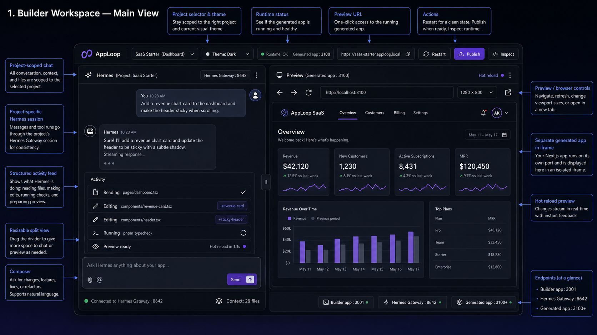
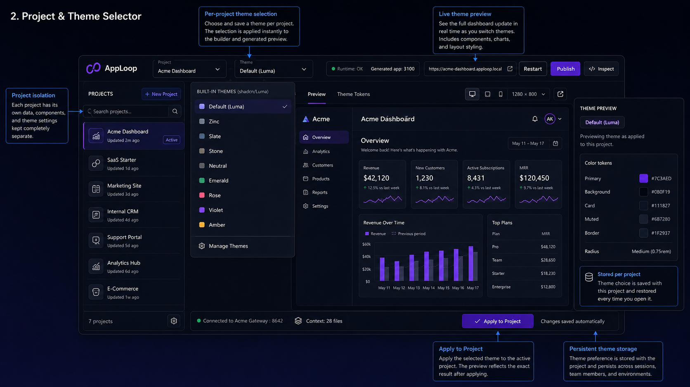
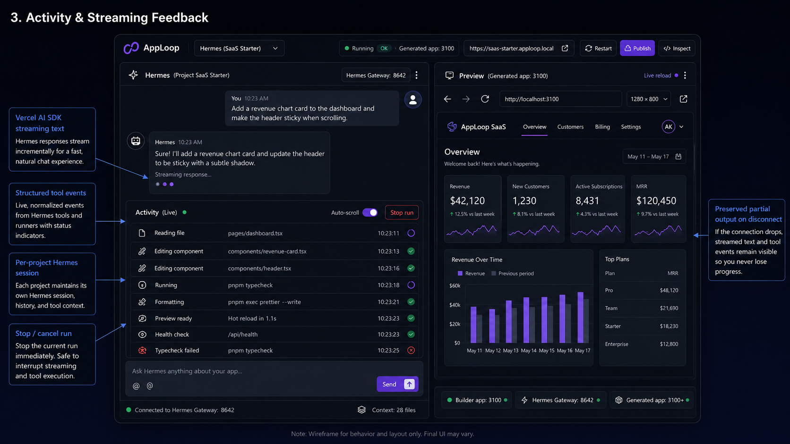
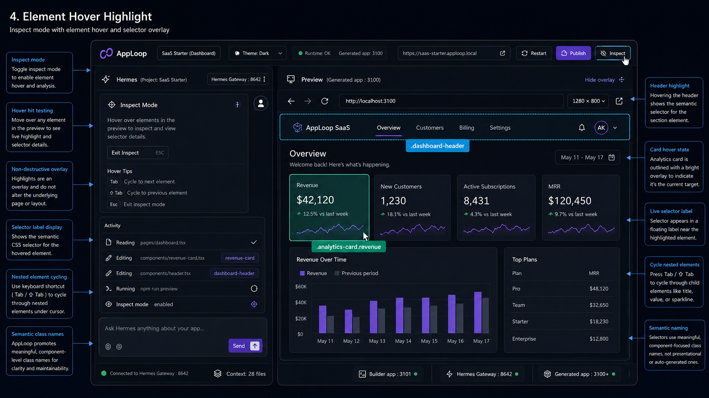
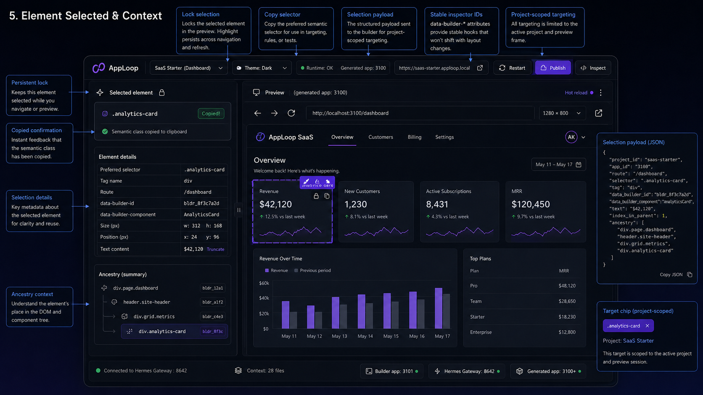
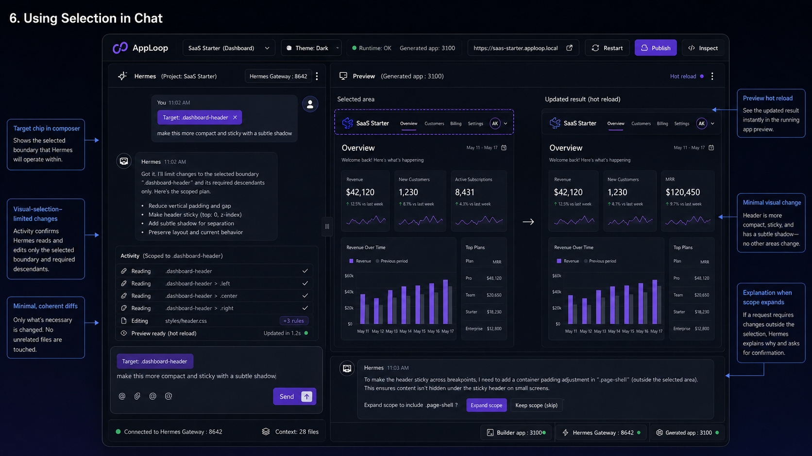
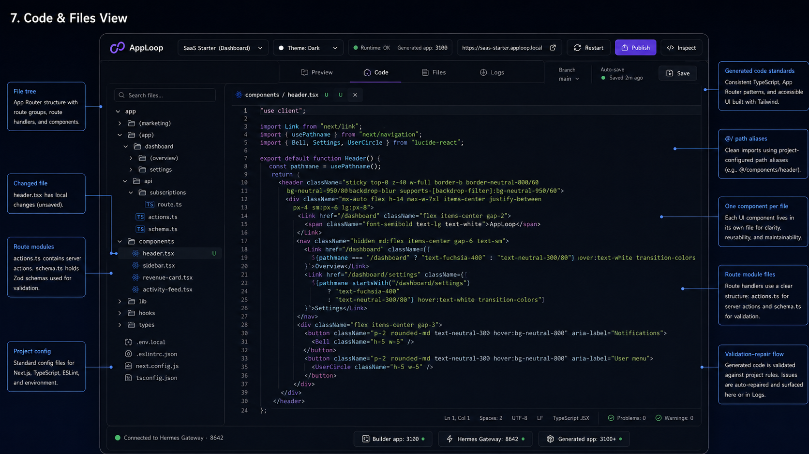
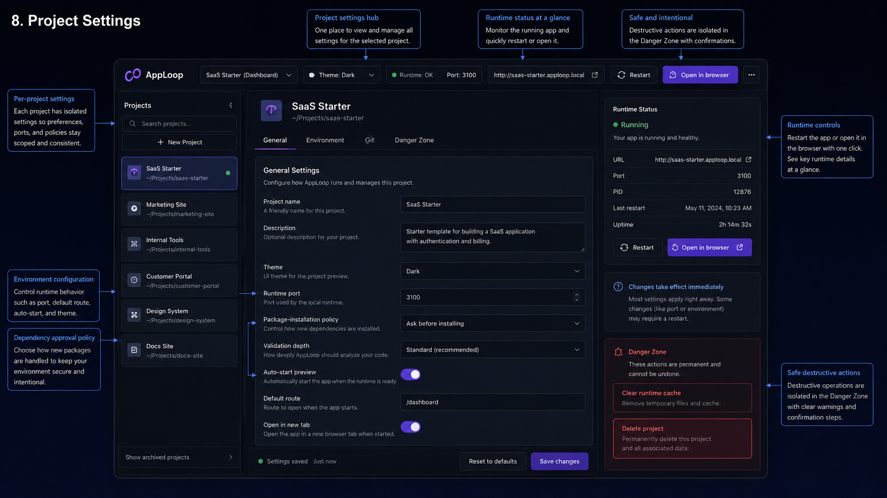
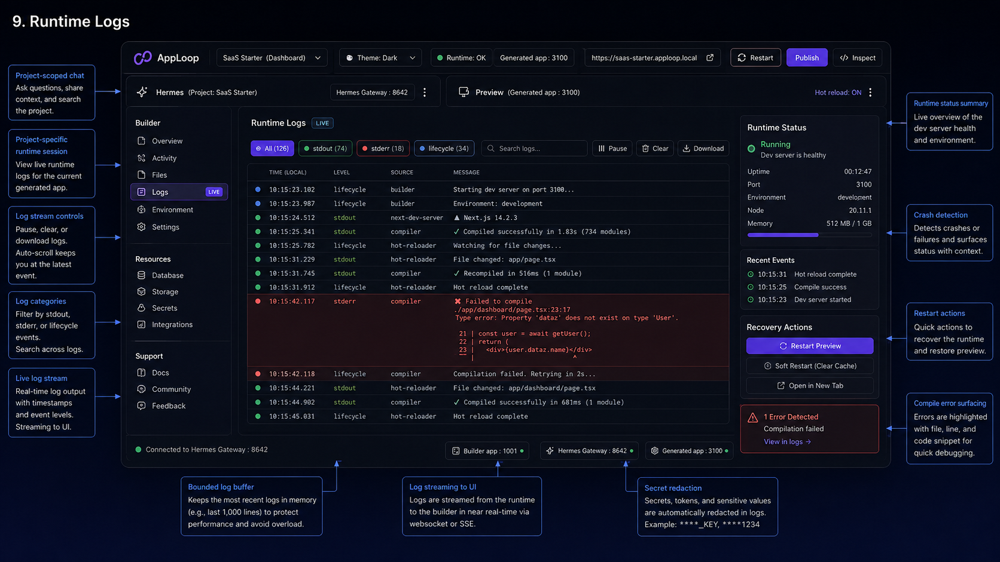
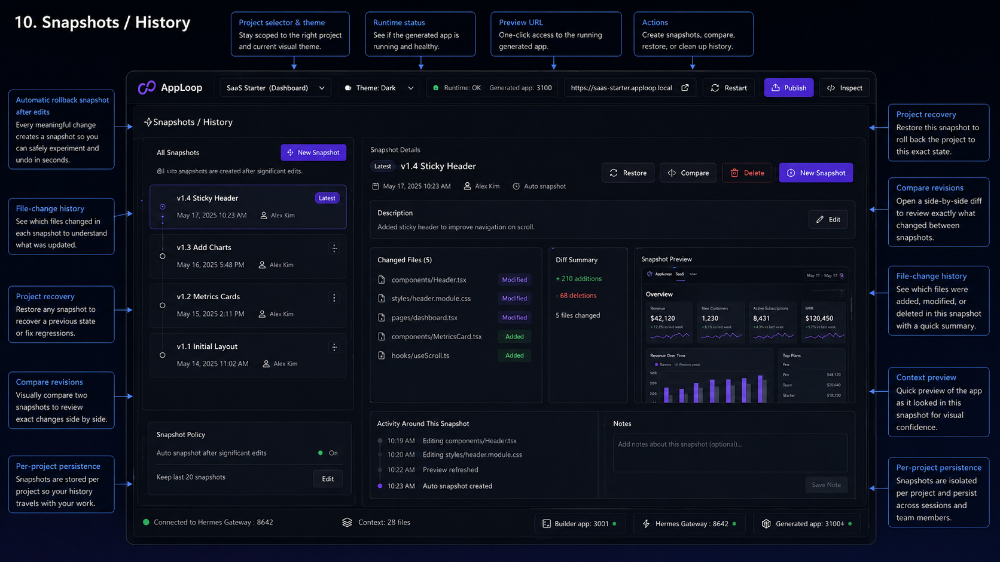

# SPECS.md — Hermes Next.js Visual App Builder

> Version: 0.2.0 | Last updated: 2026-07-10

---

## Legend

- `[ ]` Todo — Not started
- `[~]` In Progress — Actively being worked on
- `[x]` Completed — Implemented and verified
- `[!]` Blocked — Waiting on an external dependency
- Uses `/frontend-design` skill — UI-intensive story requiring the design system
- Uses `/project-runtime` skill — Generated-project process and preview lifecycle
- Uses `/hermes-gateway` skill — Hermes streaming and session integration
- Uses `/visual-selector` skill — iframe element inspection and boundary targeting
- Uses `/theme-system` skill — shadcn/Luma theme selection and application
- Uses `/generated-app-standards` skill — mandatory generated-code conventions
- Uses `/security-review` skill — path, process, iframe, and project isolation review

---

## Progress Summary

| Epic | Stories | Todo | In Progress | Completed | Blocked |
|---|---:|---:|---:|---:|---:|
| E1: Repository & Builder Foundation | 5 | 0 | 0 | 5 | 0 |
| E2: Project Management | 5 | 0 | 0 | 5 | 0 |
| E3: Generated Project Runtime | 6 | 0 | 0 | 6 | 0 |
| E4: Hermes Backend & Streaming Chat | 6 | 0 | 0 | 6 | 0 |
| E5: Hermes Agent Architecture | 5 | 0 | 0 | 5 | 0 |
| E6: Hermes Skills & Bundles | 6 | 0 | 0 | 6 | 0 |
| E7: Hermes Hooks & Commands | 6 | 0 | 0 | 6 | 0 |
| E8: Live Preview Browser | 5 | 0 | 0 | 5 | 0 |
| E9: Visual Element Selection | 7 | 0 | 0 | 7 | 0 |
| E10: shadcn/Luma Theme System | 6 | 0 | 0 | 6 | 0 |
| E11: Generated App Code Standards | 5 | 0 | 0 | 5 | 0 |
| E12: File Generation & Editing | 5 | 0 | 0 | 5 | 0 |
| E13: Validation & Repair Loop | 5 | 0 | 0 | 5 | 0 |
| E14: Persistence & Recovery | 5 | 0 | 0 | 5 | 0 |
| E15: Security & Isolation | 7 | 0 | 0 | 7 | 0 |
| E16: UX, Accessibility & Responsiveness | 5 | 0 | 0 | 5 | 0 |
| E17: Testing & Observability | 6 | 0 | 0 | 6 | 0 |
| E18: Deployment & Remote Runtimes | 5 | 5 | 0 | 0 | 0 |
| **Total** | **100** | **5** | **0** | **95** | **0** |

---

## Product Definition

The product is a local-first, project-based visual Next.js application builder inspired by the interaction model of v0.

A user selects a project, talks to a Hermes agent through a Vercel AI SDK chat interface on the left, and sees that project running live in an iframe on the right.

The builder connects to the Hermes backend through WebSocket or REST transports. Vercel AI SDK is the chat and streaming abstraction because it supports multiple model/provider backends and streaming UI responses, while Hermes provides gateway integrations for routed agent execution.

Streaming is required. Assistant text, observable agent activity, and run status must arrive progressively rather than waiting for a full run to complete.

The builder application and generated application are separate Next.js processes.

```text
Main Builder Next.js App
http://localhost:3001

├── Project selector
├── Left column
│   └── Vercel AI SDK chat
│       └── Builder chat API
│           └── Hermes backend via WebSocket or REST
│               └── Hermes Gateway integrations
│                   http://127.0.0.1:8642
├── Right column
│   └── Browser-like preview iframe
│       └── Generated Next.js app
│           http://127.0.0.1:3100+
└── Runtime manager
    ├── Project filesystem
    ├── Port allocation
    ├── Process lifecycle
    ├── Logs
    └── Health checks
```

Each project owns:

- Its generated Next.js source tree
- Its Hermes conversation/session
- Its selected shadcn/Luma theme
- Its preview port and runtime process
- Its chat history
- Its runtime logs
- Its file-change history
- Its selected visual element context
- Its snapshots and optional Git repository

The iframe displays a real running Next.js development server. It is not a screenshot, static HTML fragment, or Vercel deployment by default.

## Wireframe References

The following wireframes in `./docs/` are the canonical visual references for the builder shell, project workflow, chat, preview, runtime, and inspection experience. Implementation stories should preserve the product behavior in this specification while using these images for layout intent, spatial relationships, and interaction surfaces.












---

## Global Product Constraints

1. The main builder runs independently from all generated applications.
2. Each generated project uses a separate filesystem root.
3. Each active generated project uses a unique preview port.
4. Each project maps to an independent Hermes session.
5. Hermes must receive an explicit workspace path on every project-scoped run.
6. Browser-provided paths, ports, process IDs, and Hermes session IDs are never trusted.
7. The Hermes API key remains server-side.
8. Hermes backend access uses server-side WebSocket or REST clients only.
9. Chat output streams progressively through Vercel AI SDK UI streams.
10. Observable agent actions stream as structured events.
11. Private model reasoning is never presented as activity.
12. Generated project changes appear through Next.js hot reload.
13. Theme selection is stored per project.
14. The selected visual element is referenced through stable semantic class names and metadata.
15. Generated code must follow the mandatory code style in this specification.
16. Deployment is separate from local or sandbox preview.

---

# E1: Repository & Builder Foundation

## US-1.1: Initialize the Main Next.js Builder [x]

As a developer I want a strict Next.js App Router project for the builder so that the product has a reliable typed foundation.

    Feature: Builder initialization
      As a developer
      I want a Next.js App Router project
      So that I can implement the project builder

      Scenario: Builder starts on its dedicated port
        Given the builder dependencies are installed
        When I run "pnpm dev --port 3001"
        Then the builder starts at "http://localhost:3001"
        And no generated project uses port 3001

      Scenario: TypeScript strict mode is enabled
        Given the builder repository exists
        When I run "pnpm typecheck"
        Then strict TypeScript validation passes
        And implicit any values are rejected

      Scenario: Path aliases work
        Given tsconfig path aliases are configured
        When a module imports "@/lib/projects/service"
        Then the module resolves without a relative parent import

### Tasks

- T-1.1.1: Initialize Next.js App Router with TypeScript and Tailwind CSS
- T-1.1.2: Configure strict TypeScript
- T-1.1.3: Configure `@/*` path alias
- T-1.1.4: Configure builder dev port 3001
- T-1.1.5: Create root error and loading boundaries
- T-1.1.6: Add `pnpm typecheck`, `pnpm lint`, and `pnpm test` scripts

---

## US-1.2: Install the Builder UI Stack [x]

As a developer I want a standard UI and state stack so that the builder can support chat, split panes, dialogs, and project state.

    Feature: Builder dependencies
      Scenario: Required packages are importable
        Given the core dependencies are installed
        When the builder compiles
        Then shadcn/ui components are importable
        And the Vercel AI SDK React hooks are importable
        And Zod schemas are importable

### Tasks

- T-1.2.1: Install and configure shadcn/ui
- T-1.2.2: Install `ai` and `@ai-sdk/react`
- T-1.2.3: Install Zod
- T-1.2.4: Install a resizable panel library or implement an accessible splitter
- T-1.2.5: Install a query/cache layer if required
- T-1.2.6: Install a lightweight state layer for builder UI state
- T-1.2.7: Add toast and dialog primitives

---

## US-1.3: Configure the Builder Directory Structure [x]

As a developer I want a predictable module layout so that runtime, Hermes, projects, preview, and chat remain separated.

    Feature: Repository organization
      Scenario: Domain modules are separated
        Given the repository structure is created
        Then Hermes integration exists under "lib/hermes"
        And runtime management exists under "lib/runtime"
        And project services exist under "lib/projects"
        And visual selection exists under "lib/visual-selector"

### Tasks

- T-1.3.1: Create `app/projects/[projectId]/page.tsx`
- T-1.3.2: Create `components/builder/`
- T-1.3.3: Create `lib/hermes/`
- T-1.3.4: Create `lib/runtime/`
- T-1.3.5: Create `lib/projects/`
- T-1.3.6: Create `lib/themes/`
- T-1.3.7: Create `lib/visual-selector/`
- T-1.3.8: Create `lib/security/`

---

## US-1.4: Configure Persistence [x]

As a developer I want persistent project and chat metadata so that projects survive builder restarts.

    Feature: Local persistence
      Scenario: Builder restarts without losing projects
        Given at least one project exists
        When the builder process restarts
        Then the project remains listed
        And its workspace path remains associated
        And its theme selection remains associated

### Tasks

- T-1.4.1: Select Drizzle or Prisma
- T-1.4.2: Configure SQLite for local development
- T-1.4.3: Define project, conversation, message, run, runtime, and theme tables
- T-1.4.4: Add migrations
- T-1.4.5: Add repository/service abstractions
- T-1.4.6: Keep PostgreSQL compatibility for a hosted version

---

## US-1.5: Configure Environment Variables [x]

As a developer I want validated environment variables so that invalid runtime configuration fails early.

    Feature: Environment configuration
      Scenario: Missing Hermes key fails safely
        Given HERMES_API_KEY is absent
        When a user sends a chat prompt
        Then the server returns a configuration error
        And no secret is requested from browser code

### Tasks

- T-1.5.1: Add a Zod environment schema
- T-1.5.2: Add `HERMES_BASE_URL`
- T-1.5.3: Add `HERMES_API_KEY`
- T-1.5.4: Add `PROJECTS_ROOT`
- T-1.5.5: Add preview port range
- T-1.5.6: Add database URL
- T-1.5.7: Add runtime timeout configuration

---

# E2: Project Management

## US-2.1: Create a Project [x]

As a user I want to create a project so that I can generate a separate Next.js application.

    Feature: Project creation
      Scenario: Create from the default template
        Given the user is on the projects page
        When the user creates a project named "CRM Dashboard"
        Then a project record is created
        And a unique workspace directory is created
        And a generated Next.js template is copied into it
        And a preview port is allocated
        And a Hermes session is created or reserved

### Tasks

- T-2.1.1: Create project creation dialog
- T-2.1.2: Implement project slug generation
- T-2.1.3: Create workspace directory
- T-2.1.4: Copy the default generated-app template
- T-2.1.5: Create project metadata
- T-2.1.6: Assign initial theme
- T-2.1.7: Initialize project runtime state

---

## US-2.2: List and Select Projects [x]

As a user I want to select an existing project so that chat and preview operate on the correct application.

    Feature: Project selection
      Scenario: Switch active project
        Given projects "CRM Dashboard" and "Portfolio" exist
        And "CRM Dashboard" is selected
        When the user selects "Portfolio"
        Then the Portfolio conversation is displayed
        And the Portfolio preview URL is loaded
        And later prompts modify only Portfolio files

### Tasks

- T-2.2.1: Build project selector
- T-2.2.2: Persist last-opened project
- T-2.2.3: Load project-specific chat
- T-2.2.4: Load project-specific runtime state
- T-2.2.5: Load project-specific theme
- T-2.2.6: Clear stale selected-element context when switching projects

---

## US-2.3: Rename, Archive, and Delete Projects [x]

As a user I want lifecycle controls so that I can organize projects.

    Feature: Project lifecycle
      Scenario: Archive a project
        Given a project exists
        When the user archives it
        Then it is removed from the active list
        And its files remain intact
        And its runtime is stopped

      Scenario: Delete a project
        Given a project exists
        When the user confirms deletion
        Then its runtime is stopped
        And its project record is deleted
        And its workspace is moved to trash or deleted according to policy

### Tasks

- T-2.3.1: Add rename action
- T-2.3.2: Add archive action
- T-2.3.3: Add restore action
- T-2.3.4: Add guarded delete action
- T-2.3.5: Stop runtime before destructive operations
- T-2.3.6: Add optional soft-delete retention

---

## US-2.4: Duplicate a Project [x]

As a user I want to duplicate a project so that I can experiment without changing the original.

    Feature: Project duplication
      Scenario: Duplicate source and theme
        Given a project has generated source and a selected theme
        When the user duplicates the project
        Then a new project receives a copied source tree
        And it receives a new project ID
        And it receives a new preview port
        And it receives a new Hermes session
        And the original remains unchanged

### Tasks

- T-2.4.1: Implement safe recursive source copy
- T-2.4.2: Exclude `.next`, process files, and transient logs
- T-2.4.3: Copy project theme and settings
- T-2.4.4: Create a new session
- T-2.4.5: Start duplicated project on demand

---

## US-2.5: Project Metadata and Settings [x]

As a user I want project settings so that I can control runtime, theme, package policy, and generation behavior.

    Feature: Project settings
      Scenario: Change project package policy
        Given project settings are open
        When the user disables automatic package installation
        Then Hermes requests approval before adding dependencies

### Tasks

- T-2.5.1: Add project settings panel
- T-2.5.2: Add package-installation policy
- T-2.5.3: Add validation depth setting
- T-2.5.4: Add auto-start preview setting
- T-2.5.5: Add default route setting
- T-2.5.6: Add selected theme setting

---

# E3: Generated Project Runtime

## US-3.1: Allocate a Unique Preview Port [x]

As a system I want a unique port for each active project so that preview processes do not conflict.

    Feature: Port allocation
      Scenario: Allocate the next available port
        Given preview ports begin at 3100
        And port 3100 is occupied
        When a project runtime starts
        Then the allocator selects another available port
        And persists that port for the project

### Tasks

- T-3.1.1: Implement port availability check
- T-3.1.2: Configure port range 3100–3999
- T-3.1.3: Add project-to-port registry
- T-3.1.4: Prevent duplicate allocations
- T-3.1.5: Release stale allocations

---

## US-3.2: Start a Generated Next.js Project [x]

As a user I want the selected project to run so that the iframe displays a live application.

    Feature: Runtime startup
      Scenario: Start project dev server
        Given a generated project exists
        When the runtime manager starts it
        Then it runs "pnpm dev --hostname 127.0.0.1 --port <port>"
        And stdout and stderr are captured
        And the runtime status becomes "starting"

      Scenario: Confirm readiness
        Given the dev server process is running
        When the health endpoint becomes reachable
        Then the runtime status becomes "running"
        And the preview URL is returned
        And the iframe loads the preview URL

### Tasks

- T-3.2.1: Implement runtime process spawning
- T-3.2.2: Set project source as process `cwd`
- T-3.2.3: Capture PID
- T-3.2.4: Capture stdout and stderr
- T-3.2.5: Add startup health checks
- T-3.2.6: Emit runtime events

---

## US-3.3: Stop and Restart a Runtime [x]

As a user I want runtime controls so that I can recover from stale or crashed previews.

    Feature: Runtime controls
      Scenario: Restart preview
        Given a runtime is running
        When the user clicks "Restart"
        Then the current process is terminated
        And a new process starts on the assigned port
        And the iframe reloads after readiness

### Tasks

- T-3.3.1: Add stop API
- T-3.3.2: Add restart API
- T-3.3.3: Terminate process trees safely
- T-3.3.4: Clear stale PID records
- T-3.3.5: Reload iframe after successful restart

---

## US-3.4: Capture Runtime Logs [x]

As a user I want runtime logs so that I can understand build and server failures.

    Feature: Runtime logs
      Scenario: Display compilation error
        Given the generated app fails to compile
        When Next.js writes an error to stderr
        Then the builder displays the error in the runtime panel
        And the error is associated with the active project

### Tasks

- T-3.4.1: Add bounded in-memory log buffer
- T-3.4.2: Persist recent logs
- T-3.4.3: Stream logs to the UI
- T-3.4.4: Distinguish stdout, stderr, and lifecycle events
- T-3.4.5: Redact secrets

---

## US-3.5: Detect Runtime Crashes [x]

As a system I want to detect process exit so that project status remains accurate.

    Feature: Crash detection
      Scenario: Dev server exits unexpectedly
        Given the runtime is marked running
        When the process exits unexpectedly
        Then runtime status becomes "failed"
        And the exit code is recorded
        And the preview panel shows a recovery action

### Tasks

- T-3.5.1: Subscribe to process exit
- T-3.5.2: Record exit code and signal
- T-3.5.3: Mark runtime failed
- T-3.5.4: Offer restart action
- T-3.5.5: Prevent infinite automatic restart loops

---

## US-3.6: Abstract Local and Remote Runtimes [x]

As a developer I want a runtime interface so that local child processes can later be replaced by sandboxes.

    Feature: Runtime abstraction
      Scenario: Local runtime implements common interface
        Given the local runtime provider is configured
        Then start, stop, restart, status, logs, and preview URL use a provider interface

### Tasks

- T-3.6.1: Define `ProjectRuntimeProvider`
- T-3.6.2: Implement `LocalProcessRuntimeProvider`
- T-3.6.3: Keep provider-specific fields out of UI components
- T-3.6.4: Add future adapters for Daytona, Docker, or Vercel Sandbox

---

# E4: Hermes Backend & Streaming Chat

## US-4.1: Connect the Builder Server to Hermes Backend [x]

As a user I want chat messages sent to Hermes so that the agent can modify my selected project.

    Feature: Hermes connection
      Scenario: Send an authenticated request
        Given Hermes backend is running at the configured URL
        And the server has a valid Hermes API key
        When the user submits a message
        Then the builder server sends it to Hermes
        And the server uses WebSocket or REST according to configuration
        And the browser never receives the Hermes API key

      Scenario: Use Hermes gateway integrations
        Given Hermes exposes gateway integrations
        When the builder starts a project-scoped run
        Then the builder routes the request through the configured Hermes gateway integration
        And the selected workspace path is included server-side

### Tasks

- T-4.1.1: Implement server-side Hermes client
- T-4.1.2: Add authorization header
- T-4.1.3: Add health check
- T-4.1.4: Add timeout and abort handling
- T-4.1.5: Add typed Hermes error mapping
- T-4.1.6: Support WebSocket and REST Hermes transports
- T-4.1.7: Select the Hermes gateway integration per environment

---

## US-4.2: Stream Assistant Text Through Vercel AI SDK [x]

As a user I want progressive text so that the interaction feels responsive.

    Feature: Streaming chat
      Scenario: Render assistant deltas
        Given Hermes returns a streaming response
        When text chunks arrive
        Then the chat renders them progressively
        And the final message is persisted once

      Scenario: Preserve provider flexibility
        Given the Vercel AI SDK transport is configured
        When the Hermes backend routes to a model provider
        Then the builder does not depend on a single provider-specific client
        And streaming remains enabled for supported providers

### Tasks

- T-4.2.1: Add project chat API route
- T-4.2.2: Integrate `useChat`
- T-4.2.3: Adapt Hermes stream to AI SDK UI stream
- T-4.2.4: Handle stream completion
- T-4.2.5: Handle disconnect and retry
- T-4.2.6: Verify streaming behavior for WebSocket and REST transports
- T-4.2.7: Keep provider-specific details behind the Hermes backend contract

---

## US-4.3: Stream Observable Agent Activity [x]

As a user I want to see what Hermes is doing so that file and runtime changes are understandable.

    Feature: Agent activity stream
      Scenario: Show file edit activity
        Given Hermes starts editing a file
        When a tool event is emitted
        Then the chat shows "Editing <path>"
        And the event is not rendered as private reasoning

      Scenario: Show validation activity
        Given Hermes runs type checking
        When the command starts
        Then the chat shows the command status
        And completion shows success or failure

### Tasks

- T-4.3.1: Define normalized builder event types
- T-4.3.2: Parse tool starts
- T-4.3.3: Parse tool completions
- T-4.3.4: Parse file changes
- T-4.3.5: Parse command output
- T-4.3.6: Parse preview-ready event
- T-4.3.7: Render transient and persisted event parts separately

---

## US-4.4: Preserve a Hermes Session Per Project [x]

As a user I want project conversations to retain context without leaking across projects.

    Feature: Project session continuity
      Scenario: Resume project conversation
        Given a project has a stored Hermes session
        When the user reopens the project
        Then new chat messages use that session

      Scenario: Prevent session mixing
        Given two projects exist
        When the active project changes
        Then the Hermes session changes to the selected project's session

### Tasks

- T-4.4.1: Store Hermes session ID
- T-4.4.2: Store session key if required
- T-4.4.3: Resolve sessions server-side
- T-4.4.4: Create session on first message
- T-4.4.5: Add optional conversation branching

---

## US-4.5: Stop an Active Hermes Run [x]

As a user I want to cancel generation so that I remain in control.

    Feature: Run cancellation
      Scenario: Stop active generation
        Given Hermes is generating changes
        When the user clicks "Stop"
        Then the browser stream is aborted
        And the Hermes run is cancelled when supported
        And completed file changes remain
        And the preview process remains running

### Tasks

- T-4.5.1: Add stop button
- T-4.5.2: Abort client transport
- T-4.5.3: Call Hermes run-stop endpoint
- T-4.5.4: Mark run cancelled
- T-4.5.5: Handle partial completion

---

## US-4.6: Recover From Hermes Failures [x]

As a user I want clear recovery behavior when Hermes is unavailable.

    Feature: Hermes recovery
      Scenario: Backend is unavailable
        Given Hermes backend is stopped or unreachable
        When the user sends a prompt
        Then the builder shows "Hermes backend unavailable"
        And offers a retry action
        And does not corrupt project state

      Scenario: Streaming transport fails mid-run
        Given a Hermes run is streaming over WebSocket or REST
        When the stream disconnects before completion
        Then the builder marks the run interrupted
        And preserves the partial assistant text and observable events
        And offers a retry action

### Tasks

- T-4.6.1: Map connection failures
- T-4.6.2: Map authentication failures
- T-4.6.3: Map malformed events
- T-4.6.4: Preserve unsent user text
- T-4.6.5: Add reconnect action
- T-4.6.6: Add mid-stream disconnect recovery

---

# E5: Hermes Agent Architecture

## US-5.1: Create the Project Builder Orchestrator Agent [x]

As a developer I want a primary orchestrator agent so that every generation request follows a controlled workflow.

    Feature: Builder orchestration
      Scenario: Route a UI generation request
        Given the user asks to add a dashboard
        When the orchestrator receives the request
        Then it resolves project context
        And delegates design, code, validation, and preview tasks
        And returns a final result only after validation

### Tasks

- T-5.1.1: Create `.hermes/agents/project-builder.md`
- T-5.1.2: Define project-context requirements
- T-5.1.3: Define delegation rules
- T-5.1.4: Define completion criteria
- T-5.1.5: Prohibit unscoped file access

---

## US-5.2: Create a UI Architect Agent [x]

As a developer I want a UI-focused agent so that layouts follow the selected theme and semantic structure.

    Feature: UI architecture
      Scenario: Generate a themed page
        Given a project has a selected Luma theme
        When a page is generated
        Then the agent uses the selected token set
        And uses shadcn/ui primitives where appropriate
        And applies semantic inspectable class names

### Tasks

- T-5.2.1: Create `.hermes/agents/ui-architect.md`
- T-5.2.2: Enforce selected theme
- T-5.2.3: Enforce semantic boundaries
- T-5.2.4: Enforce responsive layout
- T-5.2.5: Enforce accessibility checks

---

## US-5.3: Create a Next.js Implementer Agent [x]

As a developer I want a code implementation agent so that generated applications follow mandatory conventions.

    Feature: Next.js implementation
      Scenario: Create a component
        Given a component is required
        When the implementer writes it
        Then it uses a kebab-case filename
        And exports one PascalCase component
        And uses a named export
        And follows the configured formatter rules

### Tasks

- T-5.3.1: Create `.hermes/agents/nextjs-implementer.md`
- T-5.3.2: Include generated-code standards
- T-5.3.3: Include route-module rules
- T-5.3.4: Include import rules
- T-5.3.5: Include schema and action patterns

---

## US-5.4: Create a Validation and Repair Agent [x]

As a developer I want an independent validation agent so that broken generated code is repaired before completion.

    Feature: Validation and repair
      Scenario: Repair a TypeScript failure
        Given generated code fails type checking
        When the validator receives the error
        Then it identifies affected files
        And applies the smallest valid repair
        And reruns type checking

### Tasks

- T-5.4.1: Create `.hermes/agents/validation-repair.md`
- T-5.4.2: Define typecheck workflow
- T-5.4.3: Define lint workflow
- T-5.4.4: Define runtime health workflow
- T-5.4.5: Limit repair attempts

---

## US-5.5: Create a Security Auditor Agent [x]

As a developer I want a security-review agent so that generated changes do not violate project isolation or expose secrets.

    Feature: Security audit
      Scenario: Reject cross-project path
        Given a proposed command references another workspace
        When the auditor evaluates it
        Then the operation is rejected
        And the run is marked blocked pending correction

### Tasks

- T-5.5.1: Create `.hermes/agents/security-auditor.md`
- T-5.5.2: Check path containment
- T-5.5.3: Check secret exposure
- T-5.5.4: Check dangerous commands
- T-5.5.5: Check iframe communication boundaries

---

# E6: Hermes Skills & Bundles

## US-6.1: Create the Frontend Design Skill [x]

As a developer I want a reusable frontend design skill so that generated apps are coherent and production-oriented.

    Feature: Frontend design skill
      Scenario: Design a responsive page
        Given a page brief
        When the skill is invoked
        Then it produces a hierarchy, responsive behavior, component map, and visual states
        And avoids generic placeholder composition

### Tasks

- T-6.1.1: Create `.hermes/skills/frontend-design/SKILL.md`
- T-6.1.2: Include layout hierarchy guidance
- T-6.1.3: Include responsive rules
- T-6.1.4: Include accessibility rules
- T-6.1.5: Include shadcn composition rules
- T-6.1.6: Include semantic class naming requirements

---

## US-6.2: Create the Generated App Standards Skill [x]

As a developer I want one authoritative code-style skill so that all generated projects use the same conventions.

    Feature: Generated app code standards
      Scenario: Generate route code
        Given Hermes creates route modules
        Then route helpers use approved module filenames
        And relative imports do not traverse more than one parent
        And components use named exports

### Tasks

- T-6.2.1: Create `.hermes/skills/generated-app-standards/SKILL.md`
- T-6.2.2: Include formatting rules
- T-6.2.3: Include export rules
- T-6.2.4: Include component rules
- T-6.2.5: Include route-colocation rules
- T-6.2.6: Include schema and action patterns

---

## US-6.3: Create the Theme System Skill [x]

As a developer I want a theme skill so that Hermes can apply and migrate selectable shadcn/Luma token sets.

    Feature: Theme application
      Scenario: Apply selected theme
        Given a project selects "Luma Indigo Emerald"
        When Hermes modifies the project
        Then the selected token file is applied
        And existing semantic token usage remains intact
        And arbitrary hard-coded colors are not introduced without justification

### Tasks

- T-6.3.1: Create `.hermes/skills/theme-system/SKILL.md`
- T-6.3.2: Define theme registry format
- T-6.3.3: Define light and dark token requirements
- T-6.3.4: Define token application workflow
- T-6.3.5: Define theme preview workflow
- T-6.3.6: Define rollback behavior

---

## US-6.4: Create the Project Runtime Skill [x]

As a developer I want a runtime skill so that Hermes can start, inspect, and validate the selected project safely.

    Feature: Runtime management skill
      Scenario: Start preview after code generation
        Given Hermes has modified project files
        When validation passes
        Then the runtime skill confirms the dev server is running
        And confirms the preview health check
        And emits a preview-ready event

### Tasks

- T-6.4.1: Create `.hermes/skills/project-runtime/SKILL.md`
- T-6.4.2: Define runtime commands
- T-6.4.3: Define log inspection
- T-6.4.4: Define readiness checks
- T-6.4.5: Define restart conditions

---

## US-6.5: Create the Visual Selector Skill [x]

As a developer I want a visual selection skill so that Hermes can interpret a class name selected from the preview.

    Feature: Visual boundary targeting
      Scenario: Modify a selected element
        Given the user selected ".dashboard-header"
        And asks "make this more compact"
        When the skill is invoked
        Then Hermes locates the class in project source
        And changes only the selected boundary and required descendants
        And reports the affected files

### Tasks

- T-6.5.1: Create `.hermes/skills/visual-selector/SKILL.md`
- T-6.5.2: Define selector payload
- T-6.5.3: Define source-location workflow
- T-6.5.4: Define boundary-limited editing rules
- T-6.5.5: Define ambiguous selector handling
- T-6.5.6: Define generated stable identifier fallback

---

## US-6.6: Create a Builder Skill Bundle [x]

As a developer I want a bundle that activates all required generation skills so that project runs are consistent.

    Feature: Skill bundle
      Scenario: Activate builder bundle
        Given a project generation run begins
        When the bundle loads
        Then frontend design, code standards, theme, runtime, selector, and security skills are available

### Tasks

- T-6.6.1: Create `.hermes/bundles/ui-builder/BUNDLE.md`
- T-6.6.2: Include `/frontend-design`
- T-6.6.3: Include `/generated-app-standards`
- T-6.6.4: Include `/theme-system`
- T-6.6.5: Include `/project-runtime`
- T-6.6.6: Include `/visual-selector`
- T-6.6.7: Include `/security-review`
- T-6.6.8: Document bundle activation order

---

# E7: Hermes Hooks & Commands

## US-7.1: Add a Project Scope Guard Hook [x]

As a developer I want every tool call checked against the selected project so that Hermes cannot edit another project.

    Feature: Project scope guard
      Scenario: Allow an in-project path
        Given the selected workspace is "/projects/a/source"
        When a tool accesses "/projects/a/source/app/page.tsx"
        Then the hook allows the operation

      Scenario: Reject an out-of-project path
        Given the selected workspace is "/projects/a/source"
        When a tool accesses "/projects/b/source/app/page.tsx"
        Then the hook blocks the operation

### Tasks

- T-7.1.1: Create `.hermes/hooks/project-scope-guard/`
- T-7.1.2: Normalize paths before evaluation
- T-7.1.3: Resolve symlinks
- T-7.1.4: Block traversal
- T-7.1.5: Log blocked operations

---

## US-7.2: Add a Generated Code Review Hook [x]

As a developer I want changed code checked automatically so that code-style violations are caught immediately.

    Feature: Generated code review
      Scenario: Reject a default component export
        Given Hermes creates a non-route component with a default export
        When the hook reviews the diff
        Then it reports a code-standard violation

### Tasks

- T-7.2.1: Create `.hermes/hooks/generated-code-review/`
- T-7.2.2: Check default exports
- T-7.2.3: Check formatting
- T-7.2.4: Check import paths
- T-7.2.5: Check file naming
- T-7.2.6: Check one-component-per-file rule

---

## US-7.3: Add a Theme Integrity Hook [x]

As a developer I want theme integrity checked so that generated changes do not bypass selected tokens.

    Feature: Theme integrity
      Scenario: Detect hard-coded theme color
        Given a generated component uses an arbitrary hex color
        When the hook reviews it
        Then it flags the color unless explicitly allowed
        And suggests the nearest semantic token

### Tasks

- T-7.3.1: Create `.hermes/hooks/theme-integrity/`
- T-7.3.2: Detect hard-coded colors
- T-7.3.3: Verify required variables
- T-7.3.4: Verify dark token block
- T-7.3.5: Verify project theme ID consistency

---

## US-7.4: Add a Preview Readiness Hook [x]

As a developer I want a final readiness gate so that Hermes does not claim success while the app is broken.

    Feature: Preview readiness
      Scenario: Block completion on compile failure
        Given the dev server reports a compile error
        When Hermes attempts to complete the run
        Then the hook blocks completion
        And routes the error to validation repair

### Tasks

- T-7.4.1: Create `.hermes/hooks/preview-readiness/`
- T-7.4.2: Check process status
- T-7.4.3: Check HTTP reachability
- T-7.4.4: Inspect recent compile errors
- T-7.4.5: Emit preview-ready only after success

---

## US-7.5: Add Builder Commands [x]

As a user I want explicit commands so that common project workflows are repeatable.

    Feature: Builder commands
      Scenario: Start project generation
        When the user invokes "/project-build"
        Then Hermes loads project context
        And applies the UI builder bundle
        And executes the requested change

### Tasks

- T-7.5.1: Create `.hermes/commands/project-build.md`
- T-7.5.2: Create `.hermes/commands/project-fix.md`
- T-7.5.3: Create `.hermes/commands/project-preview.md`
- T-7.5.4: Create `.hermes/commands/project-theme.md`
- T-7.5.5: Create `.hermes/commands/project-element-edit.md`
- T-7.5.6: Create `.hermes/commands/project-validate.md`
- T-7.5.7: Create `.hermes/commands/project-snapshot.md`

---

## US-7.6: Define the `.hermes` Layout [x]

As a developer I want a documented Hermes directory so that agents, skills, hooks, commands, and bundles remain maintainable.

    Feature: Hermes directory layout
      Scenario: Validate required assets
        Given the repository contains `.hermes`
        When the configuration audit runs
        Then all required agents, skills, bundles, hooks, and commands are present

### Required Layout

```text
.hermes/
├── agents/
│   ├── project-builder.md
│   ├── ui-architect.md
│   ├── nextjs-implementer.md
│   ├── validation-repair.md
│   └── security-auditor.md
├── bundles/
│   └── ui-builder/
│       └── BUNDLE.md
├── skills/
│   ├── frontend-design/
│   │   └── SKILL.md
│   ├── generated-app-standards/
│   │   └── SKILL.md
│   ├── hermes-gateway/
│   │   └── SKILL.md
│   ├── project-runtime/
│   │   └── SKILL.md
│   ├── security-review/
│   │   └── SKILL.md
│   ├── theme-system/
│   │   └── SKILL.md
│   └── visual-selector/
│       └── SKILL.md
├── hooks/
│   ├── generated-code-review/
│   ├── preview-readiness/
│   ├── project-scope-guard/
│   └── theme-integrity/
└── commands/
    ├── project-build.md
    ├── project-element-edit.md
    ├── project-fix.md
    ├── project-preview.md
    ├── project-snapshot.md
    ├── project-theme.md
    └── project-validate.md
```

### Tasks

- T-7.6.1: Create the directory tree
- T-7.6.2: Add metadata to every asset
- T-7.6.3: Document inputs and outputs
- T-7.6.4: Add validation script for required files
- T-7.6.5: Add version fields

---

# E8: Live Preview Browser

## US-8.1: Render the Generated App in an Iframe [x]

As a user I want the generated app visible on the right so that I can inspect changes immediately.

    Feature: Live iframe preview
      Scenario: Load running project
        Given the selected project's runtime is healthy
        When the builder receives its preview URL
        Then the iframe loads that URL
        And the preview is interactive

### Tasks

- T-8.1.1: Create `preview-frame.tsx`
- T-8.1.2: Bind iframe source to active project
- T-8.1.3: Add loading state
- T-8.1.4: Add runtime failure state
- T-8.1.5: Add iframe sandbox policy

---

## US-8.2: Add Browser-Like Controls [x]

As a user I want basic navigation controls so that I can interact with project routes.

    Feature: Preview toolbar
      Scenario: Reload preview
        Given the iframe is loaded
        When the user clicks reload
        Then the current iframe route reloads

### Tasks

- T-8.2.1: Add back control
- T-8.2.2: Add forward control
- T-8.2.3: Add reload control
- T-8.2.4: Add route field
- T-8.2.5: Add open-in-new-tab control
- T-8.2.6: Add viewport size selector

---

## US-8.3: Preserve Preview Route [x]

As a user I want the current route preserved during hot reload so that I remain on the area being edited.

    Feature: Route preservation
      Scenario: Edit a nested page
        Given the preview is on "/dashboard/settings"
        When Hermes edits the page
        Then hot reload preserves "/dashboard/settings"

### Tasks

- T-8.3.1: Track current preview route
- T-8.3.2: Receive route updates from iframe bridge
- T-8.3.3: Restore route after runtime restart
- T-8.3.4: Validate route belongs to preview origin

---

## US-8.4: Support Responsive Preview Sizes [x]

As a user I want desktop, tablet, and mobile sizes so that generated pages can be reviewed responsively.

    Feature: Responsive preview
      Scenario: Switch to mobile viewport
        When the user chooses mobile
        Then the iframe container uses the configured mobile width
        And the generated app remains centered

### Tasks

- T-8.4.1: Add desktop preset
- T-8.4.2: Add tablet preset
- T-8.4.3: Add mobile preset
- T-8.4.4: Add custom size
- T-8.4.5: Persist size per project

---

## US-8.5: Reflect Hot Reload Changes [x]

As a user I want source changes to appear automatically so that generation feels immediate.

    Feature: Hot reload
      Scenario: Hermes edits a component
        Given the project dev server is running
        When Hermes saves a component
        Then Next.js recompiles
        And the iframe displays the new component without a full deployment

### Tasks

- T-8.5.1: Confirm dev server HMR works inside iframe
- T-8.5.2: Avoid unnecessary iframe source resets
- T-8.5.3: Show compiling status
- T-8.5.4: Show compilation failure status

---

# E9: Visual Element Selection

## US-9.1: Inject an Inspector Bridge Into Generated Apps [x]

As a developer I want a project template inspector bridge so that the parent builder can identify hovered and selected elements.

    Feature: Inspector bridge
      Scenario: Enable inspect mode
        Given the generated app is loaded
        When the builder enables inspect mode
        Then the iframe bridge begins tracking eligible elements
        And normal application interaction can be temporarily suppressed

### Tasks

- T-9.1.1: Create generated-app inspector provider
- T-9.1.2: Add parent-to-iframe `postMessage` protocol
- T-9.1.3: Add iframe-to-parent `postMessage` protocol
- T-9.1.4: Validate parent origin
- T-9.1.5: Disable bridge outside builder mode

---

## US-9.2: Highlight Hovered UI Boundaries [x]

As a user I want hovered elements highlighted so that I can choose the exact block to change.

    Feature: Hover highlight
      Scenario: Hover a semantic container
        Given inspect mode is active
        When the pointer enters an element with class "dashboard-header"
        Then an overlay outlines the element
        And a label displays ".dashboard-header"

### Tasks

- T-9.2.1: Implement hover hit testing
- T-9.2.2: Draw non-destructive overlay
- T-9.2.3: Display selector label
- T-9.2.4: Reposition overlay on scroll and resize
- T-9.2.5: Ignore inspector overlays themselves
- T-9.2.6: Support nested element cycling

---

## US-9.3: Select and Lock an Element [x]

As a user I want to click an element so that its boundary becomes the target for my next chat instruction.

    Feature: Element selection
      Scenario: Select a card
        Given inspect mode is active
        When the user clicks an element with class "analytics-card"
        Then the element remains highlighted
        And the builder stores its selector context
        And the chat composer shows "Target: .analytics-card"

### Tasks

- T-9.3.1: Add click selection
- T-9.3.2: Lock selected overlay
- T-9.3.3: Send selection payload to parent
- T-9.3.4: Display selected target in chat
- T-9.3.5: Add clear-selection action
- T-9.3.6: Reset selection when project changes

---

## US-9.4: Copy the Selected Class Name [x]

As a user I want to copy the semantic class name so that I can reference it manually in chat.

    Feature: Copy class selector
      Scenario: Copy selected class
        Given ".right-column" is selected
        When the user clicks the selector label
        Then ".right-column" is copied to the clipboard
        And a confirmation toast appears

### Tasks

- T-9.4.1: Add copy action to overlay label
- T-9.4.2: Add copy action to builder target chip
- T-9.4.3: Prefer stable semantic class
- T-9.4.4: Warn when the selector is not unique

---

## US-9.5: Send Rich Selection Context to Hermes [x]

As a developer I want more than a raw class string so that Hermes can locate the correct source boundary.

    Feature: Selection payload
      Scenario: Build a source-target payload
        Given an element is selected
        When the user submits a prompt
        Then the request includes semantic class names
        And includes tag name
        And includes stable inspector ID when available
        And includes route
        And includes bounded DOM ancestry
        And includes the element text summary

### Selection Payload

```ts
export interface VisualSelection {
  projectId: string
  route: string
  tagName: string
  classNames: string[]
  preferredSelector: string
  inspectorId?: string
  componentName?: string
  sourceFile?: string
  sourceLine?: number
  textPreview?: string
  ancestry: Array<{
    tagName: string
    classNames: string[]
    inspectorId?: string
  }>
  boundingRect: {
    x: number
    y: number
    width: number
    height: number
  }
}
```

### Tasks

- T-9.5.1: Define selection schema
- T-9.5.2: Validate payload with Zod
- T-9.5.3: Include route
- T-9.5.4: Include ancestry
- T-9.5.5: Include source metadata when available
- T-9.5.6: Strip sensitive content

---

## US-9.6: Enforce Semantic Class Names in Generated Apps [x]

As a developer I want important layout boundaries to have stable class names so that visual selection remains understandable.

    Feature: Semantic boundary classes
      Scenario: Generate a dashboard layout
        When Hermes creates a dashboard
        Then important boundaries include semantic classes
        And examples include "dashboard-header", "dashboard-content", "left-column", "center-column", "right-column", and "dashboard-footer"

### Semantic Class Naming Rules

Use human-readable semantic class names on major boundaries:

```text
app-shell
page-shell
page-header
page-content
page-footer
dashboard-shell
dashboard-header
dashboard-content
dashboard-footer
sidebar
sidebar-header
sidebar-content
sidebar-footer
left-column
center-column
right-column
top-section
main-section
bottom-section
hero-section
features-section
pricing-section
form-section
table-section
analytics-card
summary-card
primary-actions
secondary-actions
```

Classes must:

- Describe layout responsibility, not visual appearance
- Remain stable across theme changes
- Avoid generated hashes
- Avoid generic names such as `box`, `item`, or `wrapper` for important boundaries
- Be unique enough to locate the intended source
- Coexist with Tailwind utility classes
- Be applied to user-meaningful boundaries
- Not replace accessible semantics

### Tasks

- T-9.6.1: Add semantic naming instructions to generated-app skill
- T-9.6.2: Add semantic boundary lint rule
- T-9.6.3: Add duplicate selector warning
- T-9.6.4: Add class naming examples
- T-9.6.5: Preserve names during refactors

---

## US-9.7: Add Stable Inspector IDs [x]

As a developer I want optional stable metadata so that selection works when multiple elements share a class.

    Feature: Stable inspector identifiers
      Scenario: Distinguish repeated cards
        Given three elements use class "summary-card"
        When the user selects the second card
        Then its `data-builder-id` identifies the exact boundary
        And Hermes can map it to source metadata

### Requirements

Generated elements may include:

```tsx
<section
  className='summary-card'
  data-builder-id='dashboard-revenue-card'
  data-builder-component='RevenueCard'
>
```

The class remains the human-readable selector. `data-builder-id` provides stable disambiguation.

### Tasks

- T-9.7.1: Define `data-builder-id` format
- T-9.7.2: Define `data-builder-component`
- T-9.7.3: Add uniqueness validation
- T-9.7.4: Keep metadata out of business logic
- T-9.7.5: Allow production stripping in future

---

# E10: shadcn/Luma Theme System

## US-10.1: Create a Theme Registry [x]

As a user I want selectable shadcn/Luma styles so that each project can have a distinct visual system.

    Feature: Theme registry
      Scenario: List available themes
        Given multiple theme definitions exist
        When the project theme picker opens
        Then each theme appears with a name, preview, light tokens, and dark tokens

### Theme Definition

```ts
export interface ProjectTheme {
  id: string
  name: string
  description: string
  preview: {
    primary: string
    secondary: string
    accent: string
    background: string
  }
  css: string
  source: 'built-in' | 'custom'
  createdAt?: string
}
```

### Tasks

- T-10.1.1: Create `lib/themes/registry.ts`
- T-10.1.2: Create theme schema
- T-10.1.3: Add built-in themes
- T-10.1.4: Add project theme field
- T-10.1.5: Add theme preview metadata

---

## US-10.2: Add the Luma Indigo Emerald Theme [x]

As a user I want the supplied theme available so that a project can use its light and dark token set.

    Feature: Luma Indigo Emerald
      Scenario: Apply theme tokens
        Given a project selects "Luma Indigo Emerald"
        When the theme is applied
        Then the project's global stylesheet contains the specified `:root` tokens
        And contains the specified `.dark` tokens
        And `--radius` is `0.625rem`

### Canonical Theme Tokens

```css
:root {
  --background: oklch(1 0 0);
  --foreground: oklch(0.145 0 0);
  --card: oklch(1 0 0);
  --card-foreground: oklch(0.145 0 0);
  --popover: oklch(1 0 0);
  --popover-foreground: oklch(0.145 0 0);
  --primary: oklch(0.488 0.243 264.376);
  --primary-foreground: oklch(0.97 0.014 254.604);
  --secondary: oklch(0.967 0.001 286.375);
  --secondary-foreground: oklch(0.21 0.006 285.885);
  --muted: oklch(0.97 0 0);
  --muted-foreground: oklch(0.556 0 0);
  --accent: oklch(0.97 0 0);
  --accent-foreground: oklch(0.205 0 0);
  --destructive: oklch(0.577 0.245 27.325);
  --border: oklch(0.922 0 0);
  --input: oklch(0.922 0 0);
  --ring: oklch(0.708 0 0);
  --chart-1: oklch(0.845 0.143 164.978);
  --chart-2: oklch(0.696 0.17 162.48);
  --chart-3: oklch(0.596 0.145 163.225);
  --chart-4: oklch(0.508 0.118 165.612);
  --chart-5: oklch(0.432 0.095 166.913);
  --radius: 0.625rem;
  --sidebar: oklch(0.985 0 0);
  --sidebar-foreground: oklch(0.145 0 0);
  --sidebar-primary: oklch(0.546 0.245 262.881);
  --sidebar-primary-foreground: oklch(0.97 0.014 254.604);
  --sidebar-accent: oklch(0.97 0 0);
  --sidebar-accent-foreground: oklch(0.205 0 0);
  --sidebar-border: oklch(0.922 0 0);
  --sidebar-ring: oklch(0.708 0 0);
}

.dark {
  --background: oklch(0.145 0 0);
  --foreground: oklch(0.985 0 0);
  --card: oklch(0.205 0 0);
  --card-foreground: oklch(0.985 0 0);
  --popover: oklch(0.205 0 0);
  --popover-foreground: oklch(0.985 0 0);
  --primary: oklch(0.424 0.199 265.638);
  --primary-foreground: oklch(0.97 0.014 254.604);
  --secondary: oklch(0.274 0.006 286.033);
  --secondary-foreground: oklch(0.985 0 0);
  --muted: oklch(0.269 0 0);
  --muted-foreground: oklch(0.708 0 0);
  --accent: oklch(0.269 0 0);
  --accent-foreground: oklch(0.985 0 0);
  --destructive: oklch(0.704 0.191 22.216);
  --border: oklch(1 0 0 / 10%);
  --input: oklch(1 0 0 / 15%);
  --ring: oklch(0.556 0 0);
  --chart-1: oklch(0.845 0.143 164.978);
  --chart-2: oklch(0.696 0.17 162.48);
  --chart-3: oklch(0.596 0.145 163.225);
  --chart-4: oklch(0.508 0.118 165.612);
  --chart-5: oklch(0.432 0.095 166.913);
  --sidebar: oklch(0.205 0 0);
  --sidebar-foreground: oklch(0.985 0 0);
  --sidebar-primary: oklch(0.623 0.214 259.815);
  --sidebar-primary-foreground: oklch(0.97 0.014 254.604);
  --sidebar-accent: oklch(0.269 0 0);
  --sidebar-accent-foreground: oklch(0.985 0 0);
  --sidebar-border: oklch(1 0 0 / 10%);
  --sidebar-ring: oklch(0.556 0 0);
}
```

### Tasks

- T-10.2.1: Add canonical token file
- T-10.2.2: Add theme metadata
- T-10.2.3: Add visual preview card
- T-10.2.4: Add light/dark validation
- T-10.2.5: Add snapshot test

---

## US-10.3: Select a Theme Per Project [x]

As a user I want to choose a theme while creating or editing a project so that generation consistently uses that style.

    Feature: Project theme selection
      Scenario: Choose theme during project creation
        Given the new project dialog is open
        When the user selects a theme
        Then the theme ID is stored on the project
        And the generated template receives its tokens

      Scenario: Change an existing project's theme
        Given an existing project is running
        When the user selects another theme
        Then Hermes applies the new token set
        And the preview hot-reloads
        And project content remains unchanged

### Tasks

- T-10.3.1: Add theme tab to project dialog
- T-10.3.2: Add theme cards
- T-10.3.3: Add live mini preview
- T-10.3.4: Store selected theme ID
- T-10.3.5: Apply theme through controlled service
- T-10.3.6: Record theme change in project history

---

## US-10.4: Add Multiple Built-In Luma Variants [x]

As a user I want multiple curated theme options so that each project can start with a different visual identity.

    Feature: Built-in theme variants
      Scenario: Browse variants
        Given the theme picker opens
        Then at least four curated token sets are available
        And each has light and dark variants

### Initial Theme IDs

```text
luma-indigo-emerald
luma-violet-cyan
luma-amber-slate
luma-rose-zinc
luma-teal-blue
luma-orange-stone
```

Only `luma-indigo-emerald` has canonical tokens specified in this document. The other variants must be added as explicit reviewed token files rather than inferred at runtime.

### Tasks

- T-10.4.1: Add curated token files
- T-10.4.2: Add preview metadata
- T-10.4.3: Validate contrast
- T-10.4.4: Validate chart token differentiation
- T-10.4.5: Add theme screenshots or fixture previews

---

## US-10.5: Support Custom Theme Tokens [x]

As a user I want to paste a shadcn theme so that I can use a custom visual system.

    Feature: Custom theme
      Scenario: Import valid tokens
        Given the user pastes valid `:root` and `.dark` blocks
        When the user saves the custom theme
        Then required variables are validated
        And the theme becomes selectable

      Scenario: Reject incomplete tokens
        Given the pasted theme omits `--background`
        When the user saves it
        Then validation fails with a missing-token message

### Tasks

- T-10.5.1: Add CSS token parser
- T-10.5.2: Validate required variables
- T-10.5.3: Store custom theme
- T-10.5.4: Generate preview metadata
- T-10.5.5: Sanitize imported CSS
- T-10.5.6: Prevent arbitrary selectors and remote imports

---

## US-10.6: Keep Generated UI Theme-Semantic [x]

As a developer I want generated components to use semantic theme variables so that switching themes works.

    Feature: Semantic theme usage
      Scenario: Generate a card
        When Hermes generates a card
        Then it uses classes such as `bg-card`, `text-card-foreground`, and `border-border`
        And does not hard-code the selected primary color

### Tasks

- T-10.6.1: Add semantic token guidance
- T-10.6.2: Add theme-integrity hook
- T-10.6.3: Add tests for theme switching
- T-10.6.4: Add exceptions policy for data visualization

---

# E11: Generated App Code Standards

## US-11.1: Enforce Formatting Rules [x]

As a developer I want every generated app to use one code style so that diffs remain predictable.

    Feature: Formatting
      Scenario: Format generated TypeScript
        Given Hermes writes a TypeScript file
        Then the file uses 2-space indentation
        And single quotes
        And trailing commas
        And no semicolons

### Mandatory Rules

```text
2-space indentation
single quotes
trailing commas
no semicolons
```

### Tasks

- T-11.1.1: Add Prettier or Biome configuration
- T-11.1.2: Add format script
- T-11.1.3: Run formatter on changed files
- T-11.1.4: Add code-review hook

---

## US-11.2: Enforce Export and Component Rules [x]

As a developer I want consistent exports so that generated components are easy to locate and refactor.

    Feature: Component conventions
      Scenario: Generate a reusable component
        When Hermes creates `project-card.tsx`
        Then it exports `ProjectCard`
        And uses a named export
        And uses a const arrow component
        And contains one primary component

### Mandatory Rules

- Named exports only
- `export default` is allowed only for:
  - `page.tsx`
  - `layout.tsx`
  - `loading.tsx`
  - `error.tsx`
  - `route.ts`
- Component files use kebab-case
- Component names use PascalCase
- One component per file
- The file name matches the primary export
- Prefer:

```tsx
export const MyComponent = () => {}
```

- Destructure props in the function signature

### Tasks

- T-11.2.1: Configure ESLint export rules
- T-11.2.2: Add filename validation
- T-11.2.3: Add one-component-per-file review
- T-11.2.4: Add component template

---

## US-11.3: Enforce Import Rules [x]

As a developer I want stable alias imports so that generated files are resilient to folder movement.

    Feature: Import conventions
      Scenario: Import a shared service
        When a route imports a shared project service
        Then it uses "@/lib/projects/service"
        And does not traverse multiple parent directories

### Mandatory Rules

- Always use the `@/` path alias for cross-directory imports
- Never use relative imports that traverse up more than one level
- Same-folder imports may use `./`
- One-level parent imports may be used only when colocation is clearer
- Prefer explicit module paths over barrel files for server-sensitive code

### Tasks

- T-11.3.1: Configure TypeScript alias
- T-11.3.2: Add ESLint import restriction
- T-11.3.3: Add auto-fix guidance to Hermes skill
- T-11.3.4: Add integration test

---

## US-11.4: Enforce Route Colocation [x]

As a developer I want route-specific logic colocated so that routes remain understandable.

    Feature: Route modules
      Scenario: Add a form route
        Given a route requires validation and server actions
        Then the route may contain `schema.ts`
        And may contain `actions.ts`
        And may contain `hooks.ts`
        And may contain `types.ts`
        And may contain `utils.ts`
        And may contain `constants.ts`

### Approved Route Module Files

```text
actions.ts
schema.ts
hooks.ts
atoms.ts
types.ts
utils.ts
constants.ts
```

Additional rules:

- Use hooks to keep components thin
- Colocate types with their route
- Extract a type to `lib/` only when used by three or more routes
- Route UI components live in `components/` under the route or approved shared component root

### Tasks

- T-11.4.1: Add route module guidance
- T-11.4.2: Add three-route extraction rule
- T-11.4.3: Add thin-component examples
- T-11.4.4: Add review checklist

---

## US-11.5: Enforce Schema and Action Patterns [x]

As a developer I want schemas and actions generated consistently so that validation and server behavior are predictable.

    Feature: Schema and action conventions
      Scenario: Generate a schema
        Then it follows:
          """
          export const PositionSchema = z.object({...})
          export type Position = z.infer<typeof PositionSchema>
          """

      Scenario: Generate an action
        Then it uses an async function declaration
        And follows a verb-noun name such as `createPosition`

### Mandatory Patterns

```ts
export const PositionSchema = z.object({
  // fields
})

export type Position = z.infer<typeof PositionSchema>
```

```ts
export async function createPosition() {
  // implementation
}
```

### Tasks

- T-11.5.1: Add schema template
- T-11.5.2: Add action template
- T-11.5.3: Add naming lint check
- T-11.5.4: Add generated-code tests

---

# E12: File Generation & Editing

## US-12.1: Generate From a Controlled Template [x]

As a developer I want generated apps initialized from a controlled template so that runtime and inspection capabilities are always present.

    Feature: Generated project template
      Scenario: Initialize a project
        Then the template includes Next.js App Router
        And TypeScript
        And Tailwind CSS
        And shadcn/ui
        And the inspector bridge
        And theme tokens
        And code-style configuration

### Tasks

- T-12.1.1: Create `templates/nextjs-default`
- T-12.1.2: Add inspector provider
- T-12.1.3: Add theme registry integration
- T-12.1.4: Add formatter and linter configuration
- T-12.1.5: Add health-compatible root route

---

## US-12.2: Generate Pages From Chat [x]

As a user I want to describe a page so that Hermes creates it in the selected project.

    Feature: Page generation
      Scenario: Generate a landing page
        Given a project is selected
        When the user asks for a SaaS landing page
        Then Hermes creates the required route and components
        And applies the selected theme
        And adds semantic boundary classes
        And validates the result
        And the iframe updates

### Tasks

- T-12.2.1: Define generation workflow
- T-12.2.2: Resolve route from request
- T-12.2.3: Generate component plan
- T-12.2.4: Apply files
- T-12.2.5: Validate
- T-12.2.6: Confirm preview

---

## US-12.3: Edit Existing Pages [x]

As a user I want iterative edits so that the application evolves through conversation.

    Feature: Iterative editing
      Scenario: Modify existing header
        Given the project has a header
        When the user asks to add navigation
        Then Hermes reads the existing implementation
        And applies the smallest coherent change
        And preserves unrelated behavior

### Tasks

- T-12.3.1: Require source inspection before edit
- T-12.3.2: Prefer minimal coherent diffs
- T-12.3.3: Preserve user-authored code
- T-12.3.4: Report affected files
- T-12.3.5: Add rollback snapshot

---

## US-12.4: Apply Visual-Selection-Limited Changes [x]

As a user I want a selected block to constrain generation so that chat edits do not affect unrelated areas.

    Feature: Boundary-limited editing
      Scenario: Edit selected right column
        Given ".right-column" is selected
        When the user asks "make this narrower"
        Then Hermes locates the right-column source
        And modifies that boundary
        And modifies required parent layout only when necessary
        And reports any expanded scope

### Tasks

- T-12.4.1: Append visual selection to run context
- T-12.4.2: Locate selector in source
- T-12.4.3: Detect ambiguity
- T-12.4.4: Require explanation for scope expansion
- T-12.4.5: Preserve selection after successful edit when element remains

---

## US-12.5: Add Dependency Installation Policy [x]

As a user I want control over package installation so that Hermes does not add unnecessary dependencies.

    Feature: Dependency policy
      Scenario: Package approval required
        Given automatic package installation is disabled
        When Hermes needs a new dependency
        Then it requests approval
        And waits before running the package manager

### Tasks

- T-12.5.1: Add project package policy
- T-12.5.2: Detect package changes
- T-12.5.3: Add approval UI
- T-12.5.4: Record approved packages
- T-12.5.5: Run package audit according to policy

---

# E13: Validation & Repair Loop

## US-13.1: Typecheck Changed Projects [x]

As a user I want type validation so that generated applications do not complete with TypeScript errors.

    Feature: Type checking
      Scenario: Validate a generated change
        When Hermes finishes writing files
        Then it runs the project typecheck command
        And reports pass or fail

### Tasks

- T-13.1.1: Add `typecheck` script to template
- T-13.1.2: Stream command status
- T-13.1.3: Parse TypeScript diagnostics
- T-13.1.4: Route failures to repair agent

---

## US-13.2: Lint and Format Changed Files [x]

As a developer I want linting and formatting so that generated code follows the project standards.

    Feature: Code quality
      Scenario: Format generated files
        Given files changed
        When generation finishes
        Then changed files are formatted
        And lint validation passes

### Tasks

- T-13.2.1: Run formatter
- T-13.2.2: Run lint
- T-13.2.3: Parse violations
- T-13.2.4: Repair safe violations automatically
- T-13.2.5: Report unresolved failures

---

## US-13.3: Verify Runtime Health [x]

As a user I want runtime health confirmed so that the preview reflects valid code.

    Feature: Preview validation
      Scenario: Confirm generated route
        Given generation targets "/dashboard"
        When validation finishes
        Then the runtime responds on "/dashboard"
        And the preview-ready event includes that route

### Tasks

- T-13.3.1: Check root runtime health
- T-13.3.2: Check target route
- T-13.3.3: Capture error response
- T-13.3.4: Prevent false completion

---

## US-13.4: Repair Failed Changes [x]

As a user I want automatic bounded repair so that common generation failures are resolved.

    Feature: Repair loop
      Scenario: Repair compile error
        Given a compile error exists
        When the repair loop runs
        Then it performs at most the configured number of attempts
        And stops when validation passes
        And reports remaining failure if exhausted

### Tasks

- T-13.4.1: Configure max repair attempts
- T-13.4.2: Snapshot before repair
- T-13.4.3: Apply minimal fix
- T-13.4.4: Revalidate
- T-13.4.5: Avoid unrelated refactors

---

## US-13.5: Add Visual Smoke Checks [x]

As a user I want basic visual checks so that blank or crashed pages are detected.

    Feature: Visual smoke validation
      Scenario: Detect blank application
        Given the route returns HTML
        When the rendered page has no visible application root
        Then the validation reports a blank-preview failure

### Tasks

- T-13.5.1: Add optional browser health check
- T-13.5.2: Detect error overlays
- T-13.5.3: Detect blank root
- T-13.5.4: Store screenshot only when configured
- T-13.5.5: Avoid using screenshots as the primary preview

---

# E14: Persistence & Recovery

## US-14.1: Persist Conversations [x]

As a user I want chat history preserved so that I can continue a project later.

    Feature: Conversation persistence
      Scenario: Reload builder
        Given project messages exist
        When the browser reloads
        Then the messages are restored in order
        And structured activity parts remain readable

### Tasks

- T-14.1.1: Persist user messages
- T-14.1.2: Persist final assistant messages
- T-14.1.3: Persist selected structured events
- T-14.1.4: Avoid duplicate final messages
- T-14.1.5: Add pagination

---

## US-14.2: Persist Project Runtime Metadata [x]

As a system I want runtime metadata retained so that stale processes can be detected after restart.

    Feature: Runtime recovery
      Scenario: Builder restarts while preview remains alive
        Given a preview process still runs
        When the builder restarts
        Then it verifies the stored PID and port
        And reconnects to the runtime if valid

### Tasks

- T-14.2.1: Persist PID, port, status, and timestamps
- T-14.2.2: Verify PID ownership
- T-14.2.3: Detect stale records
- T-14.2.4: Reconcile runtime state at startup

---

## US-14.3: Create Project Snapshots [x]

As a user I want snapshots so that I can recover from an undesirable generation.

    Feature: Project snapshots
      Scenario: Snapshot before generation
        Given a project is about to change
        When generation starts
        Then a source snapshot is created
        And transient directories are excluded

### Tasks

- T-14.3.1: Create snapshot service
- T-14.3.2: Exclude `.next` and `node_modules`
- T-14.3.3: Store run-to-snapshot mapping
- T-14.3.4: Add restore action
- T-14.3.5: Add retention policy

---

## US-14.4: Recover an Interrupted Generation [x]

As a user I want interrupted runs marked clearly so that I know project state may be partial.

    Feature: Interrupted run recovery
      Scenario: Builder exits during generation
        Given a run is marked running
        When the builder starts again
        Then the run is marked interrupted
        And the user can validate, continue, or restore its snapshot

### Tasks

- T-14.4.1: Reconcile active runs at startup
- T-14.4.2: Mark interrupted status
- T-14.4.3: Offer validate action
- T-14.4.4: Offer restore action
- T-14.4.5: Offer continue action

---

## US-14.5: Add Optional Git History [x]

As a user I want optional Git commits so that generated changes have durable version history.

    Feature: Git integration
      Scenario: Commit successful generation
        Given Git history is enabled
        When validation succeeds
        Then changed files are committed with a generated conventional message

### Tasks

- T-14.5.1: Initialize optional project repository
- T-14.5.2: Commit after successful runs
- T-14.5.3: Store run ID in commit metadata
- T-14.5.4: Never commit secrets
- T-14.5.5: Add diff view

---

# E15: Security & Isolation

## US-15.1: Protect Hermes Credentials [x]

As a security engineer I want Hermes credentials server-side so that preview and browser code cannot steal them.

    Feature: Credential protection
      Scenario: Inspect browser bundle
        Then HERMES_API_KEY is absent
        And generated project environment files do not contain it

### Tasks

- T-15.1.1: Keep secrets in builder server environment
- T-15.1.2: Block `NEXT_PUBLIC_HERMES_*`
- T-15.1.3: Redact logs
- T-15.1.4: Add secret scan

---

## US-15.2: Enforce Workspace Containment [x]

As a security engineer I want all file operations contained so that a project cannot escape its workspace.

    Feature: Filesystem containment
      Scenario: Reject traversal
        Given the workspace root
        When an operation resolves to "../other-project"
        Then the operation is rejected

### Tasks

- T-15.2.1: Normalize absolute paths
- T-15.2.2: Resolve symlinks
- T-15.2.3: Check containment after resolution
- T-15.2.4: Block special filesystem paths
- T-15.2.5: Test traversal cases

---

## US-15.3: Restrict Process Execution [x]

As a security engineer I want command controls so that generated project operations cannot damage the host.

    Feature: Command safety
      Scenario: Reject privileged command
        When Hermes proposes a privileged command
        Then the command is blocked
        And requires a safe alternative

### Tasks

- T-15.3.1: Run as non-root
- T-15.3.2: Add command timeout
- T-15.3.3: Add environment allowlist
- T-15.3.4: Add denied command patterns
- T-15.3.5: Add destructive-operation approval

---

## US-15.4: Secure Iframe Messaging [x]

As a security engineer I want verified cross-window messages so that another page cannot spoof selections.

    Feature: Secure postMessage
      Scenario: Ignore untrusted origin
        Given a message originates outside the active preview origin
        When the builder receives it
        Then the message is ignored

### Tasks

- T-15.4.1: Validate `event.origin`
- T-15.4.2: Validate message schema
- T-15.4.3: Include project and preview nonce
- T-15.4.4: Rotate nonce on runtime restart
- T-15.4.5: Reject stale project IDs

---

## US-15.5: Isolate Preview Origins [x]

As a security engineer I want preview applications isolated from the builder so that generated code cannot access builder cookies or DOM.

    Feature: Preview isolation
      Scenario: Hosted preview uses separate origin
        Given the application is hosted
        Then generated previews use a separate preview domain
        And builder authentication cookies are not sent to that domain

### Tasks

- T-15.5.1: Keep local preview on separate port
- T-15.5.2: Plan wildcard preview domain
- T-15.5.3: Configure iframe sandbox
- T-15.5.4: Avoid shared auth cookies
- T-15.5.5: Add CSP strategy

---

## US-15.6: Sanitize Custom Themes [x]

As a security engineer I want imported themes constrained so that arbitrary CSS cannot compromise the builder or preview.

    Feature: Theme sanitization
      Scenario: Reject remote import
        Given custom CSS contains `@import`
        When it is validated
        Then it is rejected

### Tasks

- T-15.6.1: Allow token declarations only
- T-15.6.2: Reject `url()`
- T-15.6.3: Reject `@import`
- T-15.6.4: Reject arbitrary selectors
- T-15.6.5: Enforce size limits

---

## US-15.7: Authorize Project Access [x]

As a security engineer I want every API route to verify ownership so that users cannot access another user's project.

    Feature: Project authorization
      Scenario: Reject another user's project ID
        Given the authenticated user does not own the project
        When they call a project API
        Then the response is forbidden
        And no project metadata is disclosed

### Tasks

- T-15.7.1: Add authorization service
- T-15.7.2: Apply to all project routes
- T-15.7.3: Apply to chat and runtime streams
- T-15.7.4: Apply to preview metadata
- T-15.7.5: Add integration tests

---

# E16: UX, Accessibility & Responsiveness

## US-16.1: Build the Resizable Split Layout [x]

As a user I want to resize chat and preview so that I can prioritize the current task.

    Feature: Resizable layout
      Scenario: Resize panels
        Given the builder is open
        When the user drags the divider
        Then chat and preview widths update
        And the width preference persists

### Tasks

- T-16.1.1: Add accessible splitter
- T-16.1.2: Set default 38/62 split
- T-16.1.3: Persist widths
- T-16.1.4: Add keyboard controls
- T-16.1.5: Add collapse controls

---

## US-16.2: Make Agent Activity Understandable [x]

As a user I want concise status cards so that I can follow progress without reading raw logs.

    Feature: Activity UX
      Scenario: Show grouped actions
        Given Hermes reads several files
        Then the UI may group them under "Inspecting project"
        And detailed paths are expandable

### Tasks

- T-16.2.1: Design activity cards
- T-16.2.2: Group repetitive events
- T-16.2.3: Add expandable details
- T-16.2.4: Distinguish warning and error states
- T-16.2.5: Keep raw logs separate

---

## US-16.3: Make Visual Selection Accessible [x]

As a keyboard user I want to select elements without relying exclusively on a mouse.

    Feature: Accessible inspection
      Scenario: Navigate inspectable boundaries
        Given inspect mode is active
        When the user presses the next-boundary shortcut
        Then focus moves to the next inspectable boundary
        And its selector is announced

### Tasks

- T-16.3.1: Add keyboard boundary navigation
- T-16.3.2: Add screen-reader announcements
- T-16.3.3: Add visible focus
- T-16.3.4: Avoid color-only highlight
- T-16.3.5: Add shortcut help

---

## US-16.4: Support Builder Theme Modes [x]

As a user I want the builder itself to support light, dark, and system modes independently from generated-project themes.

    Feature: Builder appearance
      Scenario: Builder dark mode does not modify project theme
        Given the builder switches to dark mode
        Then only the builder UI changes
        And the generated project retains its configured theme mode

### Tasks

- T-16.4.1: Add builder theme provider
- T-16.4.2: Separate builder and project themes
- T-16.4.3: Persist builder preference
- T-16.4.4: Avoid iframe theme coupling

### Builder App Theme

The builder application shell uses the canonical Luma Indigo Emerald light and dark token set from E10 for its own `:root` and `.dark` globals. This keeps builder appearance aligned with Luma while remaining independent from each generated project's selected theme.

---

## US-16.5: Add Clear Empty and Error States [x]

As a user I want explicit states so that I know whether a project is starting, compiling, disconnected, or failed.

    Feature: State clarity
      Scenario: Preview is starting
        Given the runtime is starting
        Then the preview shows startup progress
        And does not show a generic blank iframe

### Tasks

- T-16.5.1: Add no-project state
- T-16.5.2: Add runtime-starting state
- T-16.5.3: Add compiling state
- T-16.5.4: Add Hermes-offline state
- T-16.5.5: Add iframe-load-error state

---

# E17: Testing & Observability

## US-17.1: Unit Test Project and Path Services [x]

As a developer I want project-domain tests so that isolation logic remains reliable.

    Feature: Project service tests
      Scenario: Resolve valid workspace path
        Then the path is accepted
      Scenario: Resolve escaped workspace path
        Then the path is rejected

### Tasks

- T-17.1.1: Test path guard
- T-17.1.2: Test project creation
- T-17.1.3: Test port allocator
- T-17.1.4: Test theme validation
- T-17.1.5: Test selector schema

---

## US-17.2: Unit Test Hermes Event Adaptation [x]

As a developer I want stream parser tests so that tool events do not appear as malformed chat text.

    Feature: Hermes adapter tests
      Scenario: Parse assistant delta
        Then a text event is emitted
      Scenario: Parse tool start
        Then a structured tool event is emitted

### Tasks

- T-17.2.1: Add event fixtures
- T-17.2.2: Test text deltas
- T-17.2.3: Test tool events
- T-17.2.4: Test malformed events
- T-17.2.5: Test stream completion

---

## US-17.3: Integration Test Runtime Lifecycle [x]

As a developer I want runtime integration tests so that generated projects reliably start and stop.

    Feature: Runtime integration
      Scenario: Start fixture project
        Then it becomes healthy
        And returns a preview URL
      Scenario: Stop fixture project
        Then its port becomes available

### Tasks

- T-17.3.1: Create fixture generated project
- T-17.3.2: Test start
- T-17.3.3: Test stop
- T-17.3.4: Test restart
- T-17.3.5: Test crash detection

---

## US-17.4: End-to-End Test Chat-to-Preview [x]

As a developer I want a complete generation test so that the core product path is verified.

    Feature: Chat-to-preview flow
      Scenario: Generate and display a page
        Given a project is created
        When the user requests a landing page
        Then Hermes streams activity
        And project files change
        And validation passes
        And the iframe displays the generated page

### Tasks

- T-17.4.1: Configure Playwright
- T-17.4.2: Add test Hermes fixture or controlled agent mode
- T-17.4.3: Verify streaming
- T-17.4.4: Verify source change
- T-17.4.5: Verify iframe output

---

## US-17.5: End-to-End Test Visual Selection [x]

As a developer I want the selector workflow tested so that user-targeted edits remain reliable.

    Feature: Visual selection flow
      Scenario: Select and modify a header
        Given inspect mode is active
        When the user selects ".page-header"
        And asks to reduce its height
        Then the target chip appears
        And the request includes selection context
        And the preview reflects the change

### Tasks

- T-17.5.1: Test hover overlay
- T-17.5.2: Test click selection
- T-17.5.3: Test copy selector
- T-17.5.4: Test postMessage origin validation
- T-17.5.5: Test selected-boundary edit

---

## US-17.6: Add Structured Observability [x]

As a developer I want structured logs and run IDs so that failures can be traced across chat, Hermes, runtime, and preview.

    Feature: Observability
      Scenario: Trace generation
        Given a user starts a run
        Then chat request, Hermes run, file changes, validation, and runtime events share a correlation ID

### Tasks

- T-17.6.1: Add correlation IDs
- T-17.6.2: Add structured server logs
- T-17.6.3: Add runtime log context
- T-17.6.4: Add duration metrics
- T-17.6.5: Add failure categorization
- T-17.6.6: Add local diagnostics export

---

# E18: Deployment & Remote Runtimes

## US-18.1: Separate Preview From Publish [ ]

As a user I want preview and deployment to be separate so that normal edits remain fast.

    Feature: Preview versus publish
      Scenario: Edit without deployment
        Given a local or sandbox preview is running
        When Hermes changes source
        Then the iframe updates through hot reload
        And no Vercel deployment is triggered

### Tasks

- T-18.1.1: Label preview as development preview
- T-18.1.2: Add separate Publish button
- T-18.1.3: Store deployment metadata independently
- T-18.1.4: Avoid automatic deployment per prompt

---

## US-18.2: Add a Vercel Publish Workflow [ ]

As a user I want to publish a validated project so that it receives a shareable deployment URL.

    Feature: Vercel publishing
      Scenario: Publish validated source
        Given validation passes
        When the user clicks Publish
        Then the project is deployed
        And the deployment URL is stored
        And preview remains available separately

### Tasks

- T-18.2.1: Add deployment provider interface
- T-18.2.2: Add Vercel provider
- T-18.2.3: Validate before publish
- T-18.2.4: Stream deployment status
- T-18.2.5: Store deployment history

---

## US-18.3: Add Remote Sandbox Runtime Support [ ]

As a developer I want remote runtime providers so that multiple users can execute isolated generated apps.

    Feature: Remote sandbox
      Scenario: Start a remote project
        Given a remote provider is configured
        When the runtime starts
        Then source is restored into an isolated environment
        And a public preview URL is returned
        And the iframe loads that URL

### Tasks

- T-18.3.1: Implement provider contract
- T-18.3.2: Evaluate Daytona
- T-18.3.3: Evaluate Docker
- T-18.3.4: Evaluate Vercel Sandbox
- T-18.3.5: Add source synchronization
- T-18.3.6: Add idle shutdown

---

## US-18.4: Support Hosted Multi-User Isolation [ ]

As a platform operator I want per-user isolation so that generated code cannot access another user's data.

    Feature: Hosted isolation
      Scenario: Two users run projects
        Then each project has an isolated runtime
        And separate preview origin
        And separate credentials
        And project-scoped storage

### Tasks

- T-18.4.1: Move metadata to PostgreSQL
- T-18.4.2: Add authenticated storage
- T-18.4.3: Add runtime quotas
- T-18.4.4: Add per-user project authorization
- T-18.4.5: Add separate preview domain

---

## US-18.5: Add Resource and Cost Controls [ ]

As a platform operator I want runtime limits so that abandoned projects do not consume unlimited resources.

    Feature: Runtime limits
      Scenario: Stop idle runtime
        Given a project has been idle beyond the configured threshold
        When the idle monitor runs
        Then the runtime is stopped or hibernated
        And source remains persisted

### Tasks

- T-18.5.1: Track activity timestamp
- T-18.5.2: Add idle shutdown
- T-18.5.3: Add CPU and memory limits
- T-18.5.4: Add concurrent runtime limits
- T-18.5.5: Add restart-on-open

---

# Data Model

## Project

```ts
export type ProjectStatus =
  | 'initializing'
  | 'ready'
  | 'generating'
  | 'error'
  | 'archived'

export type RuntimeStatus =
  | 'stopped'
  | 'starting'
  | 'running'
  | 'restarting'
  | 'failed'

export interface Project {
  id: string
  userId: string
  name: string
  slug: string
  status: ProjectStatus
  workspacePath: string
  templateId: string
  themeId: string
  previewPort: number
  previewUrl: string | null
  previewRoute: string
  runtimeProvider: string
  runtimeStatus: RuntimeStatus
  runtimePid: number | null
  hermesSessionId: string | null
  hermesSessionKey: string | null
  latestRunId: string | null
  latestError: string | null
  createdAt: string
  updatedAt: string
  lastOpenedAt: string | null
  archivedAt: string | null
}
```

## Conversation

```ts
export interface Conversation {
  id: string
  projectId: string
  hermesSessionId: string | null
  createdAt: string
  updatedAt: string
}
```

## Agent Run

```ts
export type AgentRunStatus =
  | 'queued'
  | 'running'
  | 'completed'
  | 'failed'
  | 'cancelled'
  | 'interrupted'

export interface AgentRun {
  id: string
  projectId: string
  conversationId: string
  userMessageId: string
  hermesRunId: string | null
  snapshotId: string | null
  status: AgentRunStatus
  selectedElement: VisualSelection | null
  startedAt: string | null
  completedAt: string | null
  error: string | null
}
```

---

# API Surface

```text
POST   /api/projects
GET    /api/projects
GET    /api/projects/:projectId
PATCH  /api/projects/:projectId
DELETE /api/projects/:projectId

POST   /api/projects/:projectId/duplicate
POST   /api/projects/:projectId/archive
POST   /api/projects/:projectId/restore

POST   /api/projects/:projectId/chat
POST   /api/projects/:projectId/runs/:runId/stop

GET    /api/projects/:projectId/runtime
POST   /api/projects/:projectId/runtime/start
POST   /api/projects/:projectId/runtime/stop
POST   /api/projects/:projectId/runtime/restart
GET    /api/projects/:projectId/runtime/logs

GET    /api/projects/:projectId/preview
PATCH  /api/projects/:projectId/preview-route

GET    /api/themes
POST   /api/themes
GET    /api/themes/:themeId
PATCH  /api/projects/:projectId/theme

POST   /api/projects/:projectId/snapshots
GET    /api/projects/:projectId/snapshots
POST   /api/projects/:projectId/snapshots/:snapshotId/restore

POST   /api/projects/:projectId/publish
GET    /api/projects/:projectId/deployments
```

---

# Builder Event Contract

```ts
export type BuilderEvent =
  | {
      type: 'assistant-delta'
      text: string
    }
  | {
      type: 'status'
      label: string
      phase:
        | 'planning'
        | 'inspecting'
        | 'editing'
        | 'validating'
        | 'starting-preview'
        | 'complete'
    }
  | {
      type: 'tool-start'
      callId: string
      toolName: string
      input?: unknown
    }
  | {
      type: 'tool-progress'
      callId: string
      message: string
    }
  | {
      type: 'tool-complete'
      callId: string
      output?: unknown
    }
  | {
      type: 'file-changed'
      path: string
      action: 'created' | 'updated' | 'deleted'
    }
  | {
      type: 'command-start'
      command: string
    }
  | {
      type: 'command-output'
      command: string
      output: string
      stream: 'stdout' | 'stderr'
    }
  | {
      type: 'runtime-status'
      status: RuntimeStatus
    }
  | {
      type: 'preview-ready'
      url: string
      route: string
    }
  | {
      type: 'visual-selection'
      selection: VisualSelection | null
    }
  | {
      type: 'error'
      code: string
      message: string
      retryable: boolean
    }
  | {
      type: 'complete'
    }
```

---

# Environment Variables

```dotenv
APP_BASE_URL=http://localhost:3001

HERMES_BASE_URL=http://127.0.0.1:8642
HERMES_API_KEY=

PROJECTS_ROOT=./data/projects
PROJECT_TEMPLATE_ROOT=./templates

RUNTIME_PROVIDER=local
PREVIEW_HOST=127.0.0.1
PREVIEW_PORT_MIN=3100
PREVIEW_PORT_MAX=3999
PREVIEW_STARTUP_TIMEOUT_MS=60000
PREVIEW_IDLE_TIMEOUT_MINUTES=60

DATABASE_URL=file:./data/builder.db

BUILDER_POSTMESSAGE_ORIGIN=http://localhost:3001
```

---

# Recommended Repository Layout

```text
.
├── .hermes/
├── app/
│   ├── api/
│   │   ├── projects/
│   │   └── themes/
│   ├── projects/
│   │   └── [projectId]/
│   │       └── page.tsx
│   ├── error.tsx
│   ├── layout.tsx
│   ├── loading.tsx
│   └── page.tsx
├── components/
│   └── builder/
│       ├── activity-card.tsx
│       ├── builder-shell.tsx
│       ├── chat-composer.tsx
│       ├── chat-panel.tsx
│       ├── message-list.tsx
│       ├── preview-frame.tsx
│       ├── preview-panel.tsx
│       ├── preview-toolbar.tsx
│       ├── project-selector.tsx
│       ├── runtime-logs.tsx
│       ├── runtime-status.tsx
│       ├── selected-target-chip.tsx
│       └── split-pane.tsx
├── data/
│   └── projects/
├── lib/
│   ├── db/
│   ├── hermes/
│   ├── projects/
│   ├── runtime/
│   ├── security/
│   ├── themes/
│   └── visual-selector/
├── templates/
│   └── nextjs-default/
├── tests/
├── package.json
└── SPECS.md
```

---

# MVP Definition of Done

The MVP is complete when a user can:

1. Open the builder at `http://localhost:3001`.
2. Create multiple projects.
3. Select a project.
4. Choose a shadcn/Luma theme for that project.
5. Start the generated project's separate Next.js server.
6. See the generated project in the right iframe.
7. Send a prompt through the Vercel AI SDK chat.
8. Receive streamed Hermes text and structured observable actions.
9. Have Hermes edit only the selected project's files.
10. See the generated project hot-reload.
11. Enable inspect mode in the iframe.
12. Hover a meaningful layout or component boundary.
13. See the semantic class name over the highlighted element.
14. Click the element to select it.
15. Copy its class name.
16. See the selected target in the chat composer.
17. Ask Hermes to modify that selected boundary.
18. Pass formatting, typecheck, lint, and preview health validation.
19. Reload the builder without losing project source, theme, or chat history.
20. Switch projects without mixing source, session, runtime, selector, or preview state.

---

# Initial Implementation Order

1. E1 — Builder foundation
2. E2 — Project management
3. E3 — Local runtime manager
4. E8 — iframe preview
5. E4 — Hermes streaming chat
6. E11 — generated app standards
7. E12 — project generation and editing
8. E13 — validation and repair
9. E10 — theme system
10. E5–E7 — Hermes agents, skills, bundles, hooks, and commands
11. E9 — visual element selection
12. E14 — persistence and recovery
13. E15 — security hardening
14. E16–E17 — UX, accessibility, tests, and observability
15. E18 — publish and remote runtime providers

---

# Open Decisions

1. Drizzle versus Prisma
2. SQLite-only MVP versus immediate PostgreSQL compatibility
3. Exact Hermes stream endpoint and event schema in the installed Hermes version
4. Whether one project may contain multiple conversations
5. Whether only the selected project runtime remains active
6. Whether project source uses snapshots, Git, or both
7. Whether package installation requires approval by default
8. Whether selector source mapping uses injected metadata, a Babel transform, or both
9. Whether `data-builder-id` is committed to source or generated during development
10. Whether preview routes use direct localhost ports or a local reverse proxy
11. Whether the first hosted runtime provider is Daytona, Docker, or Vercel Sandbox
12. Whether visual-selection overlays are rendered inside the iframe or in the parent using geometry messages
13. Whether custom themes are user-private or shareable
14. Whether the builder supports only Next.js initially or defines a framework adapter now
